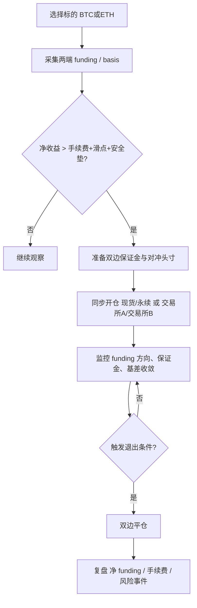
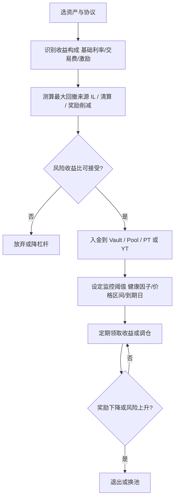
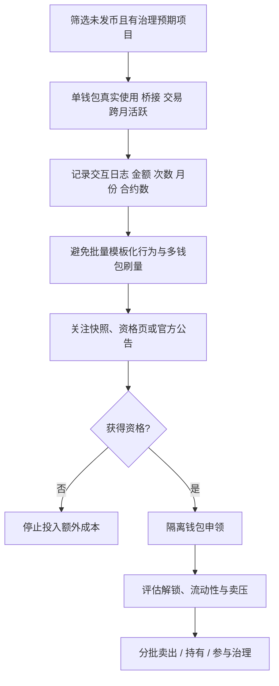

# 区块链与币圈盈利场景研究报告

## 执行摘要

过去五年里，币圈“赚钱”的方式已经明显分化成两大类：一类是**风险转移型**，本质上靠承接波动、期限、流动性或执行风险获利，例如做市、流动性提供、借贷利差、资金费率套利、预测市场做市；另一类是**信息与分发型**，本质上靠更快的发现、执行或获客获利，例如链上主动交易、空投埋伏、NFT 铸造/翻转、数据与研究服务、代币经济设计与发行支持。前者更接近“可工业化”的业务，后者上限更高，但收益分布更极端、复现性更差。官方文档、学术研究和社区案例共同指向一个一致结论：**越接近“基础设施、对冲、中性、服务”一侧，收益越可持续；越接近“抢跑、叙事、杠杆、PVP”一侧，收益越依赖时机与执行，并呈现显著的幸存者偏差。** 

从可执行性看，**中级从业者最容易形成正期望且可复用的场景**，通常不是纯方向性投机，而是四类：其一，**质押/再质押/节点**，靠协议奖励、运行质量和附加奖励获取相对稳健回报，但要承受运维、罚没与收益下行风险；其二，**借贷/稳定币收益/收益率交易**，靠 DSR、贷存利差、Pendle 的 PT/YT、Morpho Vault 这类“利率市场”获取收益；其三，**资金费率/基差/中性对冲**，靠现货与永续之间、不同交易所之间的资金费率差与价差获利；其四，**数据、研究、自动化工具与发行支持**，本质是卖软件、卖信息、卖工作流，而非只卖风险承担。相比之下，**链上 meme/PVP 交易、NFT 翻转、单边高杠杆合约**收益上限虽然高，但社区真实样本里“亏损、被夹、被 rug、被滑点吃掉”的比例远高于稳定业务。 

本报告的核心结论是：若以“中级区块链从业者”作为读者假设，**最值得优先配置时间的不是“赌方向”，而是先建立一套可复制的收益底座**。具体排序大致是：**节点/质押与借贷收益**作为底仓，**中性套利与预测市场做市**作为进阶，**空投/Launchpad/新资产发现**作为机会仓，**链上主动交易与 NFT**只适合有明确 edge、严格仓位纪律和自动化执行能力的人。若缺少自动化、风控和合规意识，那么 meme 币、低流动性 NFT、跨平台高杠杆套利，往往会把“看起来很高的 APY/赔率/倍数”迅速转化成资金损失。 

## 方法与数据来源

本报告按用户要求，以**过去五年**为主时间窗，优先使用**官方文档、学术论文、交易所规则页、项目白皮书/技术文档**，再用 **X、GitHub、Reddit、中文教程/论坛/媒体**做交叉验证。官方与学术资料主要用于确认机制、费用、限制、结算规则与风险边界；社区资料主要用于确认“真实世界怎么做”“哪些地方会踩坑”“哪些收益宣称在实操中会被滑点、手续费和流动性打折”。这意味着：**社区案例是操作观察，不是收益保证；X/Reddit 的自报战绩默认按“未经审计”处理。** 

需要特别说明的有三点。第一，**收益率不是常数**。比如资金费率、借贷 APY、Polymarket 的 maker rebate 比例、Launchpool 参与回报、NFT 二级市场流动性，都可能在数小时到数周内明显变化，因此文中的“收益率范围”凡无法用稳定公开基准验证者，都以**经验区间或不可稳定验证**标注。第二，**法律/合规结论是风险分层，不是法律意见**；不同司法辖区对加密衍生品、预测市场、代币发行、KYC/AML 和税务申报的要求差异很大。第三，**部分平台存在明确地域限制**；例如 Polymarket 开发者仓库已明确提示其条款禁止美国人及部分受限司法辖区人员通过 UI、API 或代理程序交易，而 Binance Launchpool 也按地区限制参与资格。 

## 分类详述

### 链上主动交易与事件驱动交易

这类盈利场景包括 DEX 现货波段、meme 币首发/二次发现、限价/止盈止损、DCA、链上 copy trading、钱包跟单、事件驱动抢反应等。Jupiter 官方把其产品定位为 Solana 现货交易基础设施，强调在价格、速度、成功率与防 MEV 之间做综合执行，并支持**限价、止盈/止损、条件单与定投**；Uniswap 则明确提醒，现货交易会受到**price impact、slippage、sandwich/front-running**影响。换言之，链上主动交易赚的不是“持有资产获得利息”，而是**信息优势、执行速度、风控纪律与路径选择**。 

**收益来源**主要是方向收益、早期发现 alpha、波动捕捉与交易执行质量提升；**收益率范围**没有可稳健验证的统一年化，呈高度右偏分布，极少数账户可能出现数倍到数十倍收益，但大量散户样本呈现持续亏损。社区样本里，Solana meme 交易者大量提到“一个 x10 被后面十个亏损抹平”“bot、rugpull、honeypot、滑点把利润吃掉”，而学术研究也指出，meme 币复制交易容易被操纵账户反向利用，盈利往往直接来自追随者亏损。对中级从业者来说，这类场景的**技术门槛**至少是中，若要长期复利则通常是高；**初始资金**可以低，但小资金更容易被手续费和失败交易侵蚀；**合规难度**中等，重点在税务、市场操纵边界和高风险代币交易的尽调责任。 

**常见失败案例**几乎都与执行而非判断本身相关：被夹子、被高税 token 吃掉、买入后无法卖出、项目方抽池子、低流动性导致价格偏离、Telegram/跟单号被“喂单”。因此，这类场景若要可复制，必须把重点放在交易前过滤：合约是否 renounced、LP 是否锁定、持仓集中度、税率、交易权限、路由深度、自动化止损是否可生效。 

### 套利与做市

这一类包括 **CEX-CEX、CEX-DEX、DEX-DEX、三角套利、spot-perp 套利、cross-exchange market making、AMM 做市、JIT/集中流动性做市**。Aave 官方把闪电贷的典型用途明确列为**套利**与**清算**；Hummingbot 则把自己定位为跨 CEX/DEX 的开源做市与算法交易框架，内置 **PMM、XEMM、AMM arbitrage、Funding Rate Arbitrage** 等策略模板。Uniswap v3/v4 的集中流动性机制进一步把“做市”从被动存钱池，转变为**主动设定价格区间与库存结构**的半专业行为。 

**收益来源**有三层：一是显性价差与价差回归，二是买卖盘差价与挂单返佣，三是协议会额外给做市/LP 的激励。Polymarket 官方就把 maker rebate 明确写成 taker fee 的再分配，主流品类返还比例通常为 **20%–25%**；Uniswap 类 AMM 则主要靠 swap fee，但论文与官方文档都提醒：AMM LP 的真实 PnL 不应只看 fee，还要扣除 **impermanent loss / loss-versus-rebalancing**。因此，**“高 APR 池子”不一定比“低 APR 但低波动池子”更赚钱**。 

**收益率范围**在这个类别里最难给固定值。纯套利单笔往往是 **bp 级到低个位数百分比**，需要速度、自动化和规模；订单簿做市更像赚 spread 与 rebates，月度表现常受库存偏移主导；AMM 做市在窄区间、高成交、低波动池子里可以出现不错 fee 收入，但一旦价格离开区间，收益可能立刻归零。**资金门槛**通常比看上去更高，因为你需要在多个市场同时备资来对冲；**技术门槛**中高到高；**合规难度**中等到高，尤其当策略涉及多账户、第三方资金或高频程序化交易。 **常见失败点**是延迟、gas、库存偏斜、滑点、深度不足、被更快的机器人抢走机会，以及“账面无风险、实际有爆仓/执行风险”。 

### 质押、再质押与节点运营

这是币圈里最接近“把资本转成准基础设施收益”的场景。以太坊官方把 home staking/solo staking 定义为需要**32 ETH、运行执行层与共识层客户端、保持在线**，并明确指出 solo staking 会获得**直接来自协议的最大奖励**，但也要承担离线罚没与更严重的 slashing 风险。以太坊官方中文页面同样强调，家庭质押通过自持密钥、家用硬件和独立节点提高去中心化，是保护网络安全的最佳路径之一。 

再质押把这个模型往前推了一步。以太坊官方对 restaking 的定义很清楚：把已质押 ETH 再拿去为其他 AVS/服务提供安全，从而在 ETH base rewards 之外赚取额外奖励，但风险从“低”提升到“低到高”。Lido CSM 则提供了一个更低资本门槛的节点运营路线：官方文档说明 CSM 以 bond 模式允许社区/独立 staker 进入节点运营集合，节点收益来自 Lido 协议分享的共识层与执行层奖励，而 bond 自身作为 stETH 还会有 rebase 部分。 

**收益来源**包括基础协议奖励、执行层打包费/MEV、再质押奖励、节点运营分成、某些活动期的生态空投；**公开可验证的收益样本**显示，solo validator 的年化常落在低个位数，Reddit 社区样本中有人记录到 **365 天 APR 约 3.95%**，也有人把 solo staking 与空投叠加后算出更高总回报，但这显然包含事件性奖励，不宜当作稳态基准。**资金门槛**从 LST 几百美金到 solo 32 ETH 差异极大；**技术门槛**从低到高跨度很大；**合规难度**整体较低到中等，但如果转入“为他人代运营/分润/托管”就会上升。**常见失败**包括断网、磁盘损坏、升级遗漏、双签/斩首、客户端集中导致系统性风险。 

### 借贷、稳定币收益与收益率交易

这类场景是 DeFi 里最接近“利率市场”的部分，包括 Aave/Morpho 借贷、Maker 的 DSR、Morpho Vault、Pendle 的 PT/YT、循环贷、稳定币 carry、清算机器人与收益率曲线交易。Maker 文档明确指出，**DSR** 的核心合约 Pot 用于让用户把 DAI 存进去赚储蓄利率；Morpho Blue 把每个市场设计成**一抵押物 + 一借贷资产**的隔离市场，Morpho Vault 则允许第三方或 DAO 配置收益 vault，把风险暴露限定在选择的抵押物与市场组合中。Pendle 又进一步把“持有收益资产”拆成 **PT（本金、类似零息债）**和 **YT（收益、可做多收益率）**，使收益率本身变成可交易对象。 

**收益来源**分四类：一是储蓄型利率，如 DSR；二是贷存利差与循环杠杆；三是协议激励；四是收益率本身的交易和期限套利。Pendle 文档甚至直接给出 YT 的“收益率杠杆”逻辑：买入 YT 等于提升对未来收益率的暴露，而且不是通过借贷实现，因此没有传统借贷那种清算线，但仍有价格与流动性风险。Binance Square 上关于 vePENDLE 的中文案例也展示了激励期收益的极端性：某些池子在 vePENDLE 加成下，流动性年化可以从 **30% 抬到 67%**；这类样本说明“收益率交易”里，代币激励与治理 bribe 常常比底层利率本身更重要。 

**收益率范围**可以分层理解：纯储蓄/借贷通常更接近**低个位数到低双位数**，激励期和收益率交易则可能显著更高，但波动和回撤也更大。**资金门槛**从很低到中等；**技术门槛**对普通存贷不高，但对清算器、循环贷和 Pendle/YT 交易则是中高。**法律/合规风险**中等，重点在税务、稳定币冻结/制裁、借贷协议治理变化。**常见失败**包括：价格大幅波动导致清算、预言机异常、智能合约漏洞、奖励削减、以及“为了追高收益使用复杂结构，结果被一轮回撤全部吃掉”。 Aave FAQ 明确写出健康因子跌破 1 会进入清算，且可被清算的比例与奖励规则是写死的。 

### 合约、基差、资金费率与期权

这是币圈里竞争最激烈但也最专业化的一块，涵盖**单边永续合约、对冲套保、现金与套利、资金费率套利、跨所资金费率套利、期权卖波动/买波动、结构化收益、清算事件策略**。Hyperliquid 文档说明其 funding **按小时支付**，设计目标是让永续价格靠近现货；dYdX 文档则更清楚地写出 funding 由 premium 与固定利率部分构成，并按小时汇总。学术上，《Fundamentals of Perpetual Futures》指出，永续是加密市场最核心的衍生品之一，市场日成交长期在高位，但**资金费率套利并不等于无风险**，因为没有像交割合约那样的到期收敛点，而且维持保证金本身就是风险来源。 

**收益来源**主要有三类：方向收益、资金费率/基差收益、波动率定价偏差。官方和社区信息都表明，最适合中级从业者复制的并不是单边高杠杆，而是**对冲后的 funding/basis carry**。Hyperliquid 的清算文档也提醒：保证金一旦跌破维持线，平台会直接进入强平或 backstop liquidation，所以“套利仓”如果对冲不严、资金配置不对称，最后也会变成方向仓。中文教程里，OneKey 已把 Hyperliquid vs Binance 的跨所资金费率套利写成标准流程：识别费率差、算净收益、准备两边保证金、同步下单、监控费率方向逆转与保证金不足；Gate 学院的中文文章也把“套保”和“资金费率套利”放在一起讲，说明行业里已经把它视作更稳健的一类衍生品玩法。 

**收益率范围**依赖极强：单边交易没有可验证的稳定区间；中性 funding arb 的公开宣传常见为**双位数 APY**，例如 X 上 TradeNeutral 曾宣传 Hyperliquid funding arbitrage vault“对冲后最高可达 21% APY”，但这类数字应视为宣传口径，不应直接当作可复制净收益；学术研究更可信的结论是，永续偏离现货的幅度在历史上显著存在，并且理论驱动的套利策略有较高 Sharpe，但会受到交易成本与流动性约束。**技术门槛**中高到高；**合规难度**高，因为很多司法辖区把加密永续/期权视作受监管衍生品。Reuters 关于 Coinbase 推出 CFTC 合规 perpetual futures 的报道，也反向印证了这类产品在美国受到明确监管框架约束。 

### 预测市场

预测市场的盈利路径可以分成三种：**方向研究交易、市场做市/奖励、跨平台与组合套利**。Polymarket 官方文档说明，它是一个非托管的、通过智能合约结算的 real-world events 交易平台，价格反映事件发生概率；其 market maker 文档又明确指出，做市商通过持续挂双边单赚 spread、maker rebate 和每日 liquidity rewards。中文官方页也明确写出：只要发布 resting limit orders，maker 就会自动参加流动性激励计划，而且奖励按日分发。 

而从学术侧看，Polymarket 恰好是近两年研究最多的链上赚钱赛道之一。关于 2024 美国大选市场的论文显示，随着流动性增加，YES+NO 的偏差半衰期从数小时下降到不足一分钟，说明市场在成熟时会迅速内生纠偏；但另一篇针对套利的研究则发现，Polymarket 上**已实现套利利润预计达 4000 万美元**，同时 NBA 市场的研究指出，尽管组合套利理论上存在，**真正确实能吃到的规模大多仍被浅薄深度限制在零售级别**。也就是说，这个赛道的 edge 真实存在，但经常不是“谁看得懂事件”，而是“谁能更快拿数据、更好路由、更懂市场之间的组合关系”。 

**收益来源**包括研究优势、复合条件市场的错定价、maker rebate、liquidity reward、以及跨 Polymarket/Kalshi/其他平台对冲。**收益率范围**无法给统一年化；做市收益更像“挂单质量 × 市场深度 × 奖励机制”的函数。Polymarket 当前 maker rebate 简则是多数类别把 **20%–25% 的 taker fee 返给 makers**，而做市奖励按市场中点附近、双边、平衡报价来算。**技术门槛**中高，若只是方向交易可以较低；若做套利或 market making，则至少中高。**合规难度**高，因为地区限制与监管属性最复杂；Polymarket 官方代理仓库明确提示美国人和部分受限地区不得通过 UI/API/agents 交易。**常见失败**是书本深度太浅、信号好但成交差、市场解析/结算条款看错、以及跨平台资金与 KYC 摩擦。 

### 空投、Launchpad、Launchpool 与代币认购

这个赛道过去五年从“免费羊毛”快速进化成了**行为设计、反女巫、KYC/地域限制、分层任务与生态忠诚度筛选**。Arbitrum 官方把首次空投的资格写得非常细：桥入资产、活跃月份、交互笔数、合约数量、交易额、Nova 交互等都会转成 points，再映射到**1,250–10,250 ARB**的区间。LayerZero 官方则在 ZRO 分发中把 Sybil 处理机制写得更强硬：先给自首窗口，再开放 bounty hunting，最后合计从 Sybil 地址里拦下了约 **1000 万 ZRO**。学术研究也证实，反 Sybil 已经成了空投设计中的核心环节，且机器学习在这个领域的识别指标可以做到很高。 

CeFi 侧的 Launchpad/Launchpool 则更像“受限申购 + 锁仓参与”。Binance 对 NOT、MANTA 等项目的公告显示，用户通过**质押 BNB/FDUSD**获取奖励，但同时明确提示：地区资格受限，而且上币后还有持续空投/释放，价格可能随之下行。也就是说，这类收益的本质并不是“无风险申购”，而是你用**平台资格、提前持仓 BNB、机会成本与解锁风险**去换取潜在超额回报。 

**收益来源**包括免费/低成本领取的代币价值、Launchpool 奖励、折价申购的上市溢价、以及参与过程中的后续身份空投。**收益率范围**极不稳定，但社区案例表明，主流大空投确实可能做出四位数到五位数美元收益；同时，烂空投、虚假任务、长周期 farming 后只拿到很小分配，也很常见。**资金门槛**从很低到中等；**技术门槛**低到中；**合规难度**中到高，尤其在 KYC 地域限制和女巫识别上。**常见失败**包括：为了刷行为做多钱包 Sybil，结果 0 分配；上币后不卖出，利润被持续解锁与情绪回撤抹掉；被假空投网站或“免费 NFT mint”钓鱼。 

### NFT 交易、铸造与创作者经济

NFT 仍然是一个能赚钱但高度非线性的赛道，盈利路径包括**白名单铸造、二级翻转、地板价做市、稀有度套利、品牌与 IP 的创作者收入、平台/工具/API 服务**。OpenSea 官方目前披露的费率是：卖家大多支付 **1% 平台费**，Primary drop 铸造可能有 **10%** 平台费，而 creator earnings 则可能是 enforced 也可能是 optional。Zora 的最新 docs 则给了一个更“产品化”的赚钱模型：creator/developer 能从 coin creation 与 trade fee 拆分中变现，同时新币前 10 秒有从 **99% 线性衰减到基础费率**的“sniper tax”，明显是为了抑制机器人秒狙。 

这意味着 NFT/创作者赛道已经从单纯“头像翻转”转向两条路：一条是**高波动低流动性投机**，另一条是**创作者/平台/开发者拿手续费或分成**。前者收益率没有稳态，社区真实案例里既有 **500 美元买入、9,000 美元卖出**的，也有同类资产从 **500 美元跌到 65 美元**的；后者则更像产品生意，赚的是交易/铸造/分发而不是图像本身。**技术门槛**对二级翻转是低到中，对 API、监控、自动上架/调价则是中；**合规难度**中等，重心在知识产权、平台条款、营销与税务。**常见失败**包括流动性蒸发、版税政策变化、假 mint、系列方跑路、以及把稀有度错认成流动性。 

### 数据、研究、代币经济设计与发行支持

这是最容易被忽略、却往往最可持续的一类：你不一定需要一直“拿自己的钱去赌”，而是可以把自己的区块链知识变成**数据库、API、仪表盘、风控引擎、监控 Bot、策略框架、代币经济模拟器、研究订阅、发行支持和顾问服务**。Dune 官方明确把自己定位为“构建链上分析工作流”的 API 套件，支持 SQL 查询、结果提取和自动化报表；其官方 Python SDK、GitHub 客户端和 Query Management 流程，基本就是一个完整的“分析即服务”最小栈。GitHub 上 Dune Client、Paradigm 的 spice、Polymarket/Hyperliquid/Jupiter 的 SDK 与 agent 框架，说明这一层的供给正在快速标准化。 

再往上走，就是**代币经济设计、发币/上币/发行支持**。公开收入数据通常不透明，但工具栈已经很明确：GitHub 上有面向 Solana 项目的 Tokenomix Simulator，也有 TokenLab、TokenSPICE 这类做 token economy 模拟的库；学术界也已把“tokenomics audit”单独做成研究主题。这个赛道的赚钱方式不是拿 APY，而是收**订阅费、定制费、审计/咨询费、集成费、顾问费**。对应地，**收益范围**无法像 DeFi 那样写成年化，但它往往是最不依赖市场方向的。**技术门槛**中高到高；**合规难度**中到高，因为一旦触及代币发行建议、市场推广、token sale 文案和收益表述，就很容易进入受监管地带。 

## 真实案例与可执行步骤

### 链上主动交易的案例与步骤

**案例一**：Reddit 的 r/solana 用户在持续四个月 meme 币交易后表示，“一个 x10 会被后面十个亏损抹平”，并明确提到使用 bot、追新币、遭遇 rugpull 与 honeypot，最后长期处于亏损状态。这是典型的**靠更快下单并不能自动获得正期望**的案例。时间约为 2024 年，账号名在帖子页面可见。 

**案例二**：GitHub 上的 `warp-id/solana-trading-bot` 与 `shakeebshams/swiper` 都把“监控 mint/LP burn/renounced/条件触发自动买卖”做成了通用机器人，说明链上主动交易确实可以工程化，但其 edge 很大程度来自风控过滤和执行标准化，而非“预测价格”。这类仓库的存在本身，就是该赛道已进入机器竞争的证据。 

**可复制步骤**可以简化成五步。先只做**高流动性链和高流动性池子**；再构建一层交易前过滤，包括 LP 是否锁定、合约权限、税率、持仓集中度；然后用 Jupiter 的限价/OCO 或私有交易池功能做止损与防夹；第四步，把单笔风险限制在总资金的 0.5%–1.5%；最后坚持做交易后复盘，把“胜率、盈亏比、滑点成本、失败交易率”拆开看，而不是只看总盈利。Jupiter 与 Uniswap 的文档都意味着：**执行质量本身就是收益来源的一部分**。 

### 套利与做市的案例与步骤

**案例一**：Hummingbot Botcamp 的 Propoit 在 2024 年 Demo Day 展示了一个 **spot-perpetual arbitrage** 策略：当现货与期货发生偏离时，买入现货、卖出永续，并在条件合适时锁定利润，同时赚取正 funding。这个案例的价值在于，它不是概念说明，而是一个“从教育到可运行脚本”的公开实现。 

**案例二**：Reddit 上一位开发者在 2026 年分享了一个跨 Polymarket/Kalshi 的聚合扫描器 `pmxt`，称可以持续找到**4–6 美分**的短期期限套利 spread，并公开了开源工具。另一位用户则分享了自己做 Polymarket 套利时几个月内总量超过 **22.5 万美元**，但也直言**市场不够深**。这两条信息互相印证：机会存在，但常常受深度约束。 

**可复制步骤**通常是：先选**深度最好、费率可预测的两端**；准备双边资金并预估手续费、gas、提现/转账摩擦；对订单簿场景优先用 Hummingbot 的 XEMM/PMM 模板；对 DEX 场景则把 active cancel、到期时间与不盈利取消阈值单独建模；最后只在**净收益大于全部显性成本 + 一定安全垫**时执行。Hummingbot 的 XEMM 文档明确写出 maker 端发限价单、成交后在 taker 端立刻对冲，且对 DEX 取消订单要考虑 gas 和延迟。 

### 质押、再质押与节点的案例与步骤

**案例一**：r/ethstaker 的 solo validator 经验贴里，作者运行一年后记录了 **3.95% 的 365 天 APR**，同时提到买了 NUC、维护存储、更新 MEV 相关配置。这是非常典型的“收益不算爆炸，但现金流和维护任务清晰”的样本。 

**案例二**：同社区另一个讨论里，有用户把 solo staking 与生态空投合并核算，给出了“单个 validator 在同一时期净得约 11 ETH”的经验数，但这显然把**非稳态空投奖励**也包含了进去。它可用于说明节点身份会衍生额外机会，但不应被视为长期年化。 

**可复制步骤**分三层。最低门槛是 LST/LRT，被动持有但收益被中介与合约风险稀释；中间层是 Lido CSM，重点是 bond、入组、fee recipient 设置与运维；最高层是 solo staking，需要 32 ETH、EL+CL 客户端、稳定网络与小概率故障应急。无论哪层，实际复盘指标都应包括：在线率、错过提议/证明、客户端多样性、硬件冗余、升级纪律。 

### 借贷、稳定币收益与收益率交易的案例与步骤

**案例一**：Aave 官方把清算人收益直接写进 FAQ：当健康因子跌破 1，清算人可以偿还部分或全部债务，并按抵押资产获得额外 bonus；GitHub 上 `dkirsche/aave-liquidator` 则把这一逻辑工程化成了完整机器人：检测不健康贷款、计算利润、执行清算。 

**案例二**：Binance Square 的中文文章展示了 vePENDLE 的收益叠加方式，并给出一个具体例子：某个 crvUSD 流动性池在 vePENDLE 增强后，年化可由 **30% 升到 67%**。这不是稳态收益，更像激励周期的“强化版利率市场”，但非常能说明 Pendle/ve 模型里“收益本身和治理投票权都能变现”。 

**可复制步骤**建议走三挡。保守档：DSR/Morpho Vault/主流稳定币借贷；进阶档：Aave/Morpho 上做低杠杆循环，用健康因子留足缓冲；高级档：Pendle 上拆成 PT/YT，分别做固定收益与 long yield。在所有档位里，最关键的不是 APR，而是**清算线离现价多远、奖励里有多少是可持续现金流、多少只是代币补贴**。 

### 合约、资金费率与期权的案例与步骤

**案例一**：X 上 `@TradeNeutral` 在 2025 年公开宣传 Hyperliquid funding arbitrage vault，可以通过捕捉永续资金费率做出“对冲型、最高 21% APY”的收益。这类案例适合拿来理解市场营销口径，也提醒读者：**看到 APY 先拆成本**，包括手续费、资金占用、融资利率、滑点与极端行情。 

**案例二**：X 上 `@HangukQuant` 回顾自己成为 crypto quant 的经历时表示，最早的策略之一就是“半系统化的 funding arbitrage”，先手工执行，再用简单代码增强。这类案例说明 funding arb 的真实入门路径往往不是一上来就高频，而是先做半自动。 

**案例三**：OneKey 的中文教程把 Hyperliquid/Binance 双边 funding arb 写成逐步 SOP：读取两个平台费率、判断方向、计算净收益、按目标杠杆准备两边保证金、同步下单，并持续监控费率反转和任一边保证金不足。它非常适合转成自己的 checklist。 

**可复制步骤**是：先只做**流动性最好、标的最成熟**的 BTC/ETH；建立 funding 监控；把两边名义敞口做成绝对对称；预留足够保证金避免单边被动强平；设置 funding 反转与 basis 收敛阈值；只把净 funding 当作“一个小时一个小时的现金流”，而不是“锁死的年化”。期权侧若没有 Greeks、保证金和期限结构经验，不建议直接做裸卖方。Deribit 的文档已经把欧式现金结算、结算时间和合约尺寸写得非常清楚，足以说明它不是“猜涨跌的高级版”，而是完整的风险管理产品。 

### 预测市场的案例与步骤

**案例一**：Reddit 上关于 Polymarket 套利的用户自报，几个月里做出了 **225,173.53 美元**交易量，同时分享了相关代码和工具，但结论是“市场没有足够流动性承接更大规模”。这直接验证了学术论文里“理论套利很多，真实可执行规模受限”的判断。 

**案例二**：另一个 r/algotrading 贴子提到，Polymarket 与 Kalshi 之间在次日到期市场里经常出现 **4–6 美分** spread，并给出了抓取器 `pmxt`。无论这类机会是否持续，至少说明“跨平台预测市场价差”在工程上是可扫描的。 

**案例三**：GitHub 上 `Polymarket/poly-market-maker` 与 `Polymarket/agents` 两个官方仓库，分别对应 CLOB 做市器和 AI/agent 框架。前者把“贴中点撤单再挂单”的 maker 逻辑公开化，后者则把数据源、推理与交易执行框架化。 

**可复制步骤**是：先只做有官方 Rewards 标记、盘口深的市场；双边挂单优先；不要只追求挂单量，而要追求在中点附近、平衡、被动的优质挂单；对于跨平台套利，要先处理好 KYC、法币/稳定币划转与到期前退出规则。论文和社区都显示，预测市场最容易被忽视的成本不是手续费，而是**成交冲击与流动性不足**。 

### 空投、Launchpool 与代币认购的案例与步骤

**案例一**：r/ethtrader 的 2024 年空投复盘贴中，作者列出十个自己参与并拿到分配的项目：Wormhole、LayerZero、zkSync、ether.fi 等，其中多次提到**五位数代币数量**或单钱包约 **1,000 美元级别**的回报，同时也坦言价格下跌会把账面利润迅速压缩。 

**案例二**：r/CryptoCurrency 一位老用户回顾自己参与 **500 个空投** 的结果：当前剩余价值约 **350 美元**，牛市峰值约 **4,000 美元**；评论区又有人补充自己拿到的 **400 UNI** 在高点大约值 **1.6 万美元**。这很好地说明了空投收益的本质：**分布极端、择时极重要、骗局极多**。 

**案例三**：Arbitrum 空投公告与 Reddit 社区同步出现了大量“我拿到几千枚 ARB”的讨论，甚至有人直接晒出 **8,000 ARB**。这类案例说明，真正的大空投不是“羊毛党专属”，而是**活跃度、时间维度、资金沉淀与多维行为**一起决定的。 

**可复制步骤**应遵守“单钱包、真实使用、长周期、低噪声”的原则：先筛选有治理潜力但尚未发币的基础设施；真实桥入、真实交易、真实跨月活跃；避免模板化脚本、批量钱包和机械重复；申领时先验证官网与合约，再用隔离钱包操作。若做 Launchpool/Launchpad，则要预先计算 BNB/平台币持有成本、锁仓机会成本和预计分配。 

### NFT 与创作者经济的案例与步骤

**案例一**：r/NFT 里用户 `TripleDoubleWatch` 表示，自己曾经用约 **500 美元**买入 Tom Brady Autograph NFT，后续在 DraftKings 市场卖出约 **9,000 美元**。这是典型的“品牌效应 + 流动性窗口”型收益。 

**案例二**：同贴中另一位用户 `TiZZaH` 则给出反面样本：同类 Brady NFT **500 美元买入，65 美元卖出**。这几乎是 NFT 二级市场风险的浓缩版：你不只是在赌项目，还在赌流动性、平台活跃度、注意力和时间窗口。 

**可复制步骤**更适合放在“创业/产品化”侧，而不是“纯翻图”侧：创作者走 OpenSea/Zora 线路，重点看平台费、creator earnings 与 distribution；交易者若没有明显社群边际或稀有度分析能力，尽量只参与流动性最强、退出路径明确的系列；工具开发者则可以围绕 Magic Eden/OpenSea API、地板价监控、成交提醒、Discord bot 打包服务。 

### 数据、研究、代币经济设计与发行支持的案例与步骤

**案例一**：Dune 官方 API 与 `duneanalytics/dune-client` 已经把“写 SQL → 拉结果 → 做报表/告警/仪表盘”标准化。对从业者而言，这意味着可以把**链上数据看板、研究订阅、告警服务、风控数据源**做成收费产品。 

**案例二**：GitHub 上的 `TokenSPICE`、`TokenLab` 与 `Tokenomix Simulator` 显示，tokenomics 建模已经有开源工具可用，可用于模拟流通、解锁、卖压与激励结构。虽然这些仓库不等于真实咨询收入，但它们说明“顾问服务”背后所需的技术栈在过去几年里已经越来越成熟。 

**案例三**：Polymarket/Hyperliquid/Jupiter 等项目都发布了官方 SDK 或 agent 框架，表明市场对**策略 API、执行代理、监控/回测/研究工具**有真实需求。面向机构或高净值客户时，这一类服务往往比自己下场拼方向更能形成可持续收入。 

**可复制步骤**是：先挑一个垂直域——如“DeFi 清算监控”“资金费率看板”“Polymarket 盘口监控”“空投资格追踪”；再用 Dune 或自建索引层把数据服务化；接着做最小付费形态，如 Telegram/Discord 警报、Notion/网页 Dashboard、API；最后才延展到咨询、研究订阅或发行支持。最重要的不是代码多复杂，而是你的数据能否直接对应客户决策。 

## 对比表格

下表的“收益区间”是**过去五年公开资料与社区案例的经验归纳**，除明确写出官方比例/案例数字外，其余均应视为**非承诺收益**；“风险概率”以低/中/高表示经验等级，而非统计置信区间。

| 场景 | 典型子策略 | 时间投入 | 起始资金 | 技术能力 | 合规难度 | 预期回报特征 | 主要风险 | 代表工具/案例 |
|---|---|---:|---:|---|---|---|---|---|
| 链上主动交易 | 限价/OCO、meme 波段、事件驱动 | 高 | 低-中 | 中-高 | 中 | 无稳定年化；右偏极强 | 夹子、rug、honeypot、滑点 | Jupiter、Uniswap、Solana bot 仓库；社区大量长期亏损样本  |
| 套利与做市 | CEX/DEX 套利、XEMM、AMM LP | 高 | 中-高 | 高 | 中-高 | 单笔多为 bp 到低个位数；靠频率与规模累积 | 深度不足、取消延迟、库存风险、LVR/IL | Hummingbot、Aave flash loans、Polymarket MM  |
| 质押/再质押/节点 | Solo、CSM、LST/LRT | 低-中 | 低到很高 | 低-高 | 低-中 | 基础质押常见低个位数；活动期另有附加奖励 | 离线、slashing、升级失败、收益下滑 | Ethereum.org、Lido CSM、ethstaker 案例  |
| 借贷与收益率交易 | DSR、Morpho Vault、Pendle PT/YT、清算 | 中 | 低-中 | 中-高 | 中 | 储蓄/借贷更稳；激励期可显著抬升 | 清算、预言机、合约漏洞、奖励消失 | Maker Pot、Morpho、Pendle、Aave Liquidator  |
| 合约与期权 | Funding/Basis、套保、卖波动 | 中-高 | 中 | 中-高 | 高 | 中性策略可争取双位数；单边无稳态 | 爆仓、funding 反转、基差扩张、结算规则 | Hyperliquid、dYdX、Deribit、OneKey 教程  |
| 预测市场 | 方向交易、maker rebate、跨平台套利 | 中-高 | 低-中 | 中-高 | 高 | 做市收益取决于挂单质量；套利多为小额高频 | 流动性浅、解析条款、地域限制 | Polymarket Rewards/Rebates、PMXT、Polymarket MM  |
| 空投/认购 | Retroactive airdrop、Launchpool、Launchpad | 中 | 低-中 | 低-中 | 中-高 | 分布极端；可四位数也可几乎为零 | Sybil 过滤、申领骗局、解锁砸盘 | Arbitrum、LayerZero、Binance Launchpool、社区复盘  |
| NFT | Mint、Flip、版税/创作者收入、监控工具 | 中 | 低-中 | 低-中 | 中 | 无稳定年化；流动性窗口决定结果 | 流动性蒸发、版税变化、假 mint | OpenSea、Zora、Magic Eden、Tom Brady 案例  |
| 数据/研究/顾问 | Dashboard、告警、API、tokenomics 建模 | 中-高 | 低 | 中-高 | 中-高 | 更像软件/咨询收入，不依赖方向 | 维护成本、客户获取、合规表述 | Dune API、dune-client、TokenSPICE/TokenLab  |

## 典型流程图

下面三张图不是某个平台的原图，而是依据官方文档与公开教程抽象出的标准作业流。

**资金费率/基差套利标准流**，基于 Hyperliquid、dYdX、OneKey 的机制说明与操作教程。 



**流动性提供/收益率交易标准流**，基于 Uniswap LP 风险、Morpho Vault、Pendle PT/YT。 



**空投参与标准流**，基于 Arbitrum 资格标准、LayerZero 反 Sybil 机制与 Binance Launchpool 规则。 



## 结论与合规安全建议

如果把“赚钱”理解为**可重复地把技术、时间和资本转成现金流**，那么本报告最强的结论并不是“哪条赛道回报最高”，而是“**哪条赛道更像一门业务而不是一张彩票**”。从这个角度看，**质押/节点、借贷/收益率交易、资金费率中性套利、预测市场做市、数据与研究服务**比“链上 PVP”“高杠杆单边”“纯 NFT 翻图”更接近可复用模型；后者不是不能赚，而是更依赖极短窗口、注意力红利与个体天赋，且社区样本里长期存活者显著少于失败者。 

面向**中级区块链从业者**，更现实的路线通常是“三层结构”。第一层是**底仓收益**：solo/CSM/LST、DSR、Morpho Vault、主流稳定币贷存；第二层是**中性增强**：资金费率/基差、Polymarket maker、成熟池子 LP；第三层才是**机会仓**：空投、Launchpool、链上新币、NFT。真正危险的不是收益低，而是把本应是第三层的高波动 PVP 误当成第一层现金流来源。 

落到实操，合规与安全上至少要遵守七条。其一，**把钱包分层**：冷钱包、策略钱包、空投钱包、测试钱包分开。其二，**高风险交易尽量使用私有路由/MEV 保护**，避免 sandwich。其三，**永续和循环贷永远先算爆仓线，再看收益率**。其四，**所有 APY 都要拆成基础收益、代币补贴、手续费返还、活动奖励四部分**。其五，**遇到需要批量多钱包、伪造身份、规避地域限制、代领他人、隐瞒受益人**的做法时，默认把它视为高合规风险。其六，**对社区帖子和 X 的收益截图保持“默认不审计”心态**。其七，**所有税务记录从第一次盈利开始留档**，包括空投成本基础、NFT 交易记录、做市返佣与 staking 收益。 

本研究也有边界。第一，社区案例大量是自报；第二，收益率高度时变，无法像国债那样给统一基准；第三，法律结论随地区与时间变化非常快，因此合规部分只能做风险分层，不能替代律师意见。尽管如此，多源验证后的结论仍然相当清楚：**真正长期可赚的钱，大多来自风控、执行、自动化、服务化与运营能力，而不是“下一次刚好猜对”。** 

## 附录

### 附录代码与运行环境

下面给出三个**可合法、可审计、偏研究/监控用途**的最小示例。它们的目的不是鼓励高频投机，而是帮助你把“公开策略描述”转成自己的数据与风控面板。

**运行环境**：Python 3.11；建议依赖 `requests`、`pandas`、`python-dotenv`、`tabulate`。Hyperliquid、Binance、Dune、Polymarket、Jupiter 均有官方 SDK 或公开 API 资料。 

**示例一：跨所资金费率扫描器**

```python
# Python 3.11+
# pip install requests pandas python-dotenv

import requests
import pandas as pd

HL_INFO = "https://api.hyperliquid.xyz/info"
BINANCE_PREMIUM = "https://fapi.binance.com/fapi/v1/premiumIndex"

def get_hyperliquid_funding():
    payload = {"type": "metaAndAssetCtxs"}
    r = requests.post(HL_INFO, json=payload, timeout=10)
    r.raise_for_status()
    meta, ctxs = r.json()
    rows = []
    for asset, ctx in zip(meta["universe"], ctxs):
        rows.append({
            "symbol": asset["name"],
            "hl_funding_hourly": float(ctx.get("funding", 0)),
            "hl_mark": float(ctx.get("markPx", 0)),
            "hl_oracle": float(ctx.get("oraclePx", 0)),
        })
    return pd.DataFrame(rows)

def get_binance_funding():
    r = requests.get(BINANCE_PREMIUM, timeout=10)
    r.raise_for_status()
    data = r.json()
    rows = []
    for x in data:
        rows.append({
            "symbol": x["symbol"].replace("USDT", ""),
            "bn_funding_8h": float(x.get("lastFundingRate", 0)),
            "bn_mark": float(x.get("markPrice", 0)),
        })
    return pd.DataFrame(rows)

if __name__ == "__main__":
    hl = get_hyperliquid_funding()
    bn = get_binance_funding()
    # 粗略统一为“每小时费率”
    bn["bn_funding_hourly"] = bn["bn_funding_8h"] / 8.0

    merged = hl.merge(bn[["symbol", "bn_funding_hourly", "bn_mark"]], on="symbol", how="inner")
    merged["hourly_spread"] = merged["hl_funding_hourly"] - merged["bn_funding_hourly"]
    merged["direction_hint"] = merged["hourly_spread"].apply(
        lambda x: "HL做空/BN做多" if x > 0 else "HL做多/BN做空"
    )
    print(
        merged.sort_values("hourly_spread", ascending=False)[
            ["symbol", "hl_funding_hourly", "bn_funding_hourly", "hourly_spread", "direction_hint"]
        ].head(20)
    )
```

对应机制依据见 Hyperliquid funding 文档、dYdX funding 文档与 OneKey 的中文操作教程。 

**示例二：Dune 自动化查询骨架**

```python
# pip install dune-client

from dune_client.client import DuneClient

API_KEY = "YOUR_DUNE_API_KEY"
QUERY_ID = 1234567  # 你的查询ID

def main():
    dune = DuneClient(api_key=API_KEY)
    result = dune.get_latest_result_dataframe(query_id=QUERY_ID)
    print(result.head())

if __name__ == "__main__":
    main()
```

SDK 与官方 API 支持见 Dune Docs 与 `dune-client`。 

**示例三：预测市场做市前的市场筛选清单**

```python
def should_mm(market):
    """
    market: 你从 Polymarket / 自建数据层拿到的市场对象
    """
    min_depth = 3000        # 盘口最小深度，示例值
    max_spread = 0.03       # 最大价差，示例值
    require_rewards = True  # 必须有奖励
    require_binary = True   # 先只做二元市场

    if require_binary and market.get("outcome_count") != 2:
        return False
    if require_rewards and not market.get("has_rewards"):
        return False
    if market.get("best_ask", 1) - market.get("best_bid", 0) > max_spread:
        return False
    if market.get("depth_usd", 0) < min_depth:
        return False
    return True
```

这个筛选逻辑来自三类证据的交集：官方奖励要求偏向“中点附近、被动、双边、平衡挂单”，社区案例与学术研究都强调真正约束套利/做市的往往是**订单簿深度**与**实际可执行规模**。 

### 参考来源索引

以下只列出本报告中最承重的一组来源，链接均已包含在引文中。

- **以太坊官方 staking / solo / restaking 文档**：定义 solo staking、32 ETH、离线罚没与 restaking 风险结构。   
- **Aave FAQ 与 Flash Loans**：借贷、健康因子、清算奖励与闪电贷套利/清算用途。   
- **Morpho / Maker / Pendle 文档**：借贷隔离、Vault 风险、DSR、PT/YT 与收益率交易。   
- **Uniswap 官方文档与支持中心**：集中流动性、LP 风险、swap protection、price impact/slippage。   
- **Hyperliquid / dYdX / Deribit 文档**：funding 公式、清算机制、期权结算规则。   
- **《Fundamentals of Perpetual Futures》**：永续合约市场结构、偏离现货与套利收益并非无风险。   
- **Polymarket 官方文档**：平台定义、liquidity rewards、maker rebates、market maker 机制。   
- **Polymarket 学术论文**：关于大选市场微观结构、套利偏差、深度约束与已实现套利利润。   
- **Arbitrum / LayerZero / Binance Launchpool 官方公告**：空投资格、反女巫、Launchpool 规则与后续抛压风险。   
- **OpenSea / Zora / Magic Eden 官方资料**：NFT 费率、创作者收益、sniper tax、API 能力。   
- **Dune 官方 docs 与 GitHub**：数据 API、Python SDK、自动化分析工作流。   
- **Hummingbot 官方 docs / release / Botcamp**：做市、套利、funding arb 与跨所做市的实操框架。   
- **Reddit 社区案例**：solo staking 实际 APR、airdrop 真实回报分布、Polymarket 套利与 meme/NFT 风险样本。   
- **中文辅助资料**：OneKey 的 funding arb 教程、Gate 合约套保教程、PANews Pendle 中文解读、Foresight/LXDAO 的 solo staking 教程。 