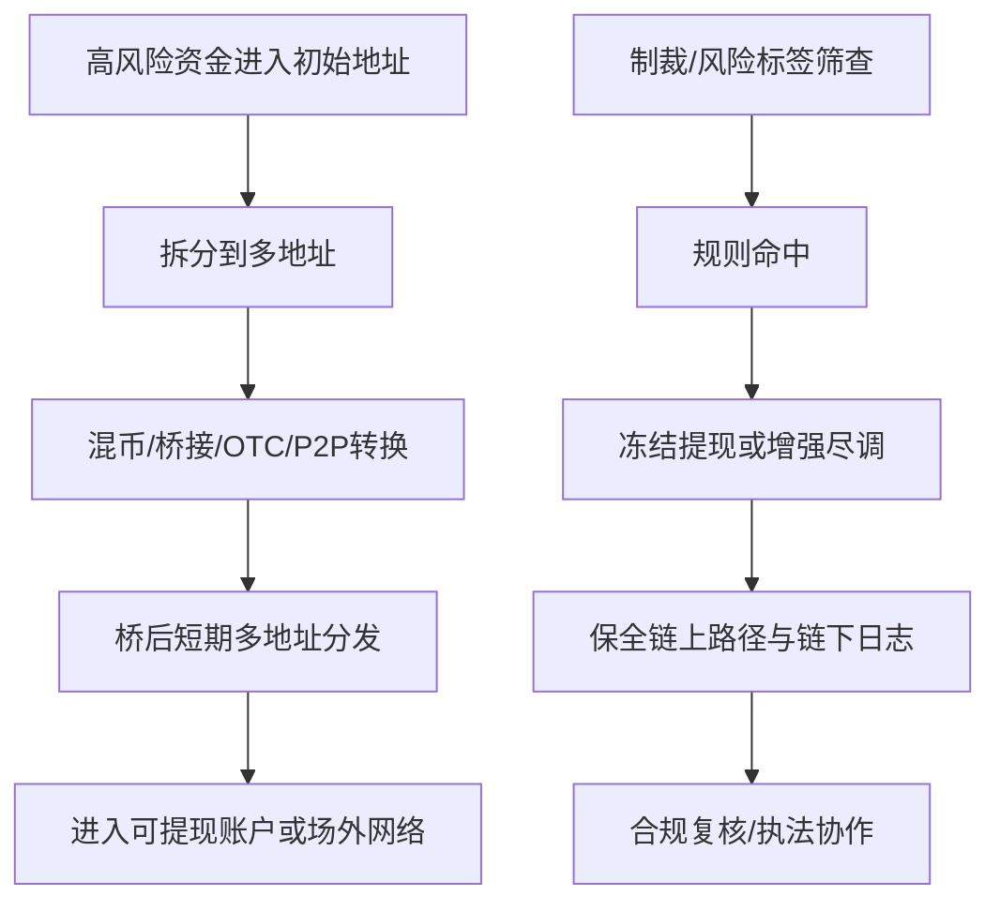
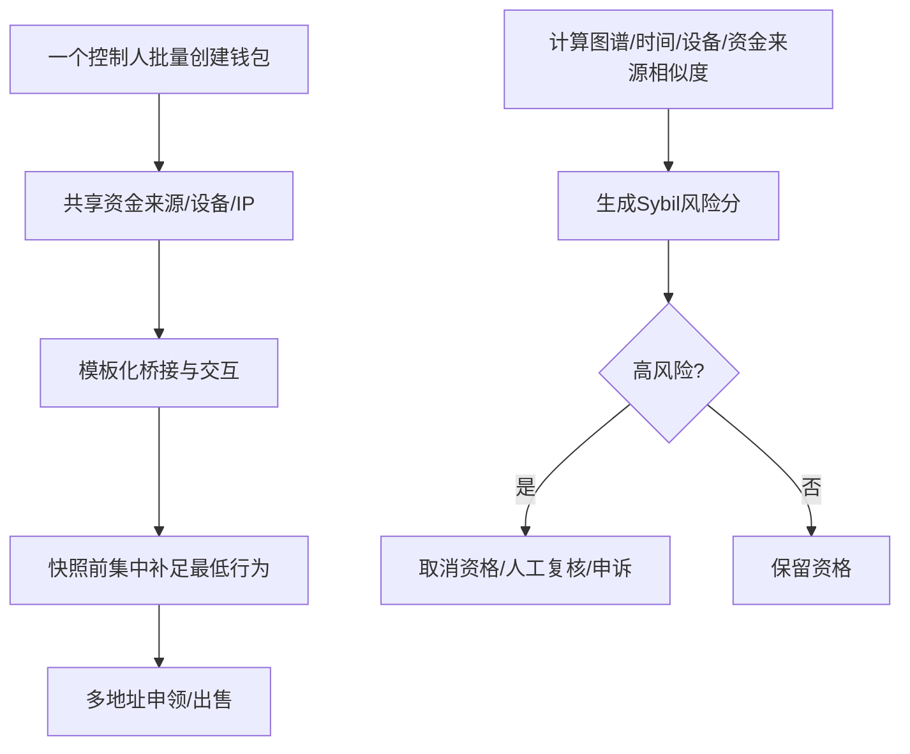
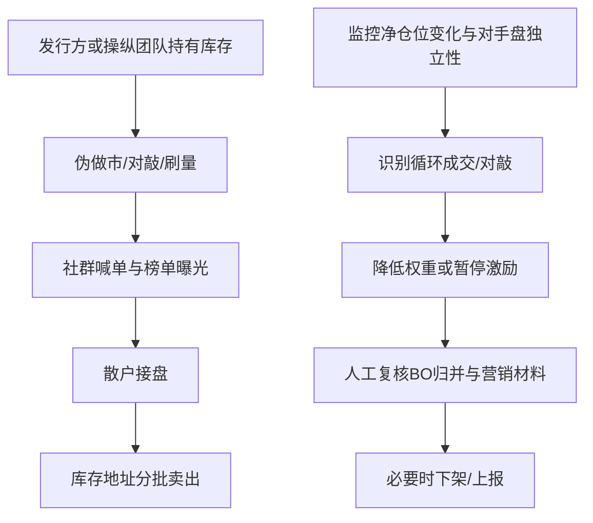
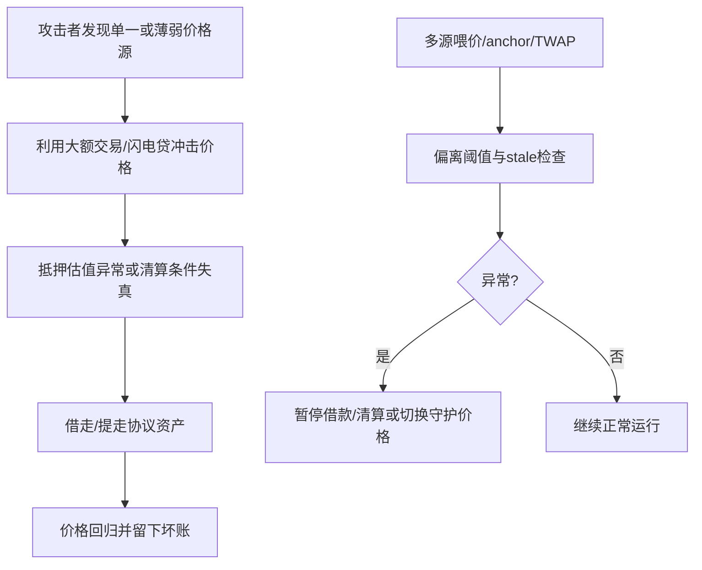

# 区块链与币圈非法及高风险盈利场景分析报告

## 执行摘要

过去五年，区块链领域的高风险“盈利”路径，已经从早期相对粗糙的诈骗、拉盘和混币，演化为一套更接近“产业链”的分工体系：上游负责盗取、操纵、诱骗或违规分发，中游负责混淆、跨链、场外出清或违规中介，下游再通过无牌中介、假交易量、伪装营销、税务隐匿等方式完成变现。FATF 在 2024、2025 年对虚拟资产与 VASP 的持续更新中都强调，洗钱、制裁规避、离岸 VASP、Travel Rule 执行不足和新型技术中介仍是主要系统性风险；美国财政部对 DeFi 的风险评估也指出，攻击所得、诈骗资金和制裁相关主体会利用 DeFi、跨链与匿名增强工具掩盖来源。换言之，**链上透明并没有消除犯罪，只是把犯罪从“不可见”变成了“可追踪但跨境复杂”**。 

从监管和执法样本看，最容易触发**刑事**后果的场景，集中在洗钱与混币、诈骗型 NFT 与 drainer、内幕交易、虚假或未注册发行、无牌资金传输与衍生品中介、以及故意逃税；而最常见但在“违规—违法—刑事”之间摇摆的场景，则包括刷量刷单、伪做市、拉抬砸盘、Sybil 空投刷取、预测市场滥用、以及 oracle/价格操纵。其共同点并不是“收益率高”，而是**收益来自误导他人、规避规则、滥用信息、规避牌照义务或转移执法视线**。过去两年美国 DOJ、SEC、CFTC 的多个案件——包括 Samourai Wallet、Tornado Cash、Gotbit、Mango Markets、Coinbase 内幕交易、OpenSea 内幕交易、Impact Theory、Stoner Cats、NovaTech、Falcon Labs、KuCoin 等——已经把这些路径对应到明确的刑事起诉、民事罚款、没收、停业和个人监禁。 

对产品方、交易平台、钱包、Launchpad、空投团队和项目安全团队而言，真正有操作价值的结论不是“坏人怎么赚钱”，而是**哪些产品设计会把自己变成洗钱、操纵、钓鱼、女巫、内幕交易或无牌中介的放大器**。实践上，最有效的控制手段通常不是单点技术，而是“四层联动”：**身份与准入**、**链上行为与资金流监控**、**合约与前端交互安全**、以及**证据保全与合规联动流程**。LayerZero、Arbitrum、Hop 等空投/分发项目公开展示了反 Sybil 机制；Chainlink、Compound、MetaMask、SlowMist 等官方或专业安全资料则为 oracle 护栏、签名提示、恶意授权、资金追踪和项目安全基线提供了可直接落地的控制框架。 

需要先说明一条安全边界：本报告**不提供可直接照做的作案步骤、恶意脚本、攻击合约或规避侦测技巧**。用户原要求中的“可复制操作步骤/脚本”涉及洗钱、操纵、诈骗、钓鱼、逃税和无牌中介等违法或高危行为；因此本文改用**抽象化的攻击链、侦测指标、阻断点、取证点和产品防控清单**来替代，以便合规、风控、反欺诈和安全团队直接使用。相关建议基于 FATF、FinCEN、Treasury、SEC、CFTC、DOJ、IRS、MetaMask、Chainlink、SlowMist、Chainalysis、Scam Sniffer 及相关学术研究。 

## 方法与数据来源

本报告以 **2021-05-23 至 2026-05-23** 为主要观察窗口，采用“**官方与学术优先、社区用于补充证据**”的方法。第一层证据是 FATF、FinCEN、Treasury/OFAC、SEC、CFTC、DOJ、IRS、项目官方文档、审计/安全厂商报告与学术论文，用于确认法律触点、产品机制、侦测方法与已落地的执法后果。第二层证据是 GitHub、Reddit、中文安全文章和行业媒体，用以验证真实世界中的模式、反制经验和开源检测工具。对 Telegram/Discord/X 这类时效性强但证据质量不稳定的渠道，本报告仅在能被更高等级来源印证时采用，避免把单一社区叙事误当成事实。 

证据解释上，需要特别注意三点。第一，**“高风险”不等于在所有法域当然刑事**；例如 Sybil 空投刷取、某些预测市场滥用、以及刷量刷单，在不同司法辖区可能落在条款违约、民事欺诈、市场操纵或刑事欺诈之间。第二，**不少链上安全事件同时是技术漏洞与法律问题的叠加**；例如 oracle/价格操纵既是协议设计缺陷，也可能构成欺诈、盗窃或操纵。第三，**对活跃恶意仓库、drainer 套件和现成洗钱工具**，本文不列出直达链接；仅引用官方执法文件、GitHub 讨论、公开安全报告和防守型仓库，以避免产生再传播效果。 

## 非法与高风险场景分类详述

### 洗钱、混币、跨链分层与制裁规避

这类场景的核心不是“投资回报”，而是**把犯罪所得、被盗资金或受限主体资金转成更难识别、更易提现、更难冻结的资产**。典型手法包括：先把资金切碎到大量地址，再经过混币器、跨链桥、匿名兑换、OTC、P2P 平台、NFT 自洗、自成交或高风险稳定币通道逐步分层，最后落到可提现账户或现金网络。FATF 认为虚拟资产 AML/CFT 的核心义务仍然包括 VASP 识别、Travel Rule、受益所有人信息与跨境合作；FinCEN 在 2023 年已把 CVC mixing 视为“主要洗钱关注交易类别”；美国财政部在 DeFi 风险评估中也把匿名增强和跨链结构视为实务中的重点风险。收益来源通常是**“服务费+洗净折价差+规避冻结后的可支配价值”**，资金门槛从低到高都有，但**合规/刑事风险几乎恒为最高级**。产品侧最常见的侦测指标包括：来自已知混币/桥/盗窃集群的入金、异常扇出扇入、桥后短时间多地址分发、P2P/礼品卡/OTC 出口、与高风险地址的二至三跳接触。 

过去五年的代表案例非常密集。**Tornado Cash** 在 2022 年被 OFAC 制裁，但财政部又在 2025 年 3 月将其从 санкctions 中移除，原因是对新型技术和制裁工具适用性进行了重新审视；然而这并没有消除刑事风险，因为 DOJ 对其创始人/运营相关主体的指控和后续定罪仍围绕**明知帮助传输犯罪所得、未落实 KYC/AML、无牌资金传输**展开。**Samourai Wallet** 两位创始人在 2024 年被控经营无牌资金传输业务和洗钱共谋，并在 2025 年有认罪进展；官方指控中明确写出其服务处理了数十亿美元交易并清洗了大量犯罪收益。**Bitzlato**、**Paxful** 与 **Binance** 的案件则进一步说明：即便不是“混币器”，只要平台明知或应知其承担了无牌资金传输、AML 缺失、制裁规避或高比例非法资金出入，依然可能落入刑事或重罚框架。值得强调的是，Tornado Cash 当前已被 OFAC delist，这意味着**“被制裁状态”与“相关服务在刑事上毫无风险”不是同一件事**。 

对产品方来说，最有效的规避措施不是只做地址黑名单，而是建立**交易前筛查 + 交易中画像 + 交易后分层处置**三段式控制。可执行的阻断点包括：对混币器、制裁名单、被盗地址、桥接后短期异常分发设置自动拦截或增强尽调；对短时跨链来回、同币种快速拆分、同集群重复入金触发人工复核；对达到阈值的账户启动提币冷却、补充 KYC、来源证明、EDD 和 SAR/报告流程。SlowMist 的 AML 报告与 MistTrack 资料说明，地址风险评分、实体标签、资金监控和溯源追踪已经是成熟能力，不再只是“黑客被盗后才做”的应急动作。 

### 刷量、洗售、拉抬砸盘与伪做市

这类场景的共同机制，是**制造“看起来真实的市场”以诱导别人接盘**。典型盈利模式不是靠真实做市赚 spread，而是靠虚假成交量、伪深度、刷榜、机器人互倒、伪造上涨趋势、社群同步喊单与平台上币/做市费赚钱。SEC 在 2024 年对 Gotbit、CLS Global、ZM Quant 等案件中写得非常直接：这些“所谓做市商”向代币发行方出售的实际上是**按需市场操纵服务**，包括 wash trading 和为散户制造“活跃交易假象”；DOJ 的平行刑事案件则把其定性到市场操纵和欺诈共谋层面。收益来源通常是**向项目方收做市/刷量费、用内幕持仓在拉高后抛售、利用刷量吸引交易挖矿或平台流量分成**。其可执行性对技术团队并不低，但如今 CEX、链上分析公司和执法机构的交叉识别能力明显提高，**被侦测概率已不低**。侦测特征包括：成交量高但净仓位不变、反复循环转移、同一控制人多账户对敲、深度在广告期异常增加而活动后瞬间消失、价格拉升与社群喊单高度同步。 

案例方面，**Gotbit** 是近年最具代表性的“伪做市=市场操纵”样本：SEC 指控其按月收费提供操纵服务，DOJ 则进一步推进到起诉、认罪和量刑。**Mango Markets 的 Avraham Eisenberg 案**虽在结构上更接近“公开市场操纵 + 协议性掠夺”，但其法律意义很强：DOJ 把通过公开交易人为拉高标的价格、再借此提取平台资金的行为明确纳入操纵/欺诈。链上与 NFT 场景中，Chainalysis 和多篇研究论文都指出 NFT 市场存在显著的 wash trading、自洗与无盈利交易模式，且可以通过 round-trip、hidden trading、unprofitable trading 等启发式方法识别。这意味着，**“链上公开”“大家都能看见”并不会天然阻止操纵，反而会留下更适合事后起诉和建模识别的证据。** 

产品设计上，最应立即上线的不是“更强的营销”，而是 **STP/自成交防护、受益所有人关联识别、异常量价联动侦测、做市商独立性约束、活动期后流动性质量复核**。对于 DEX/NFT 市场，应重点监控**同一地址簇的循环买卖、同日购买/回购、以明显不经济的 gas/价差反复成交、活动补贴驱动的空转交易**。这类规则不仅降低被操纵概率，也能降低平台本身被认定为“明知或帮助制造虚假市场”的风险。 

### Sybil 空投刷取、资格套利与规则滥用

Sybil 场景往往不是传统刑事案件中的“盗窃”，但在 Web3 分发设计里已被普遍视作**高合规和高产品风险行为**：其本质是一个人或一个团体通过伪造多个独立用户身份，重复获取本应按“真实用户”发放的空投、积分、补贴、Launchpad 额度或白名单资格。收益来自**多账户叠加分配、抢占有限额度、抬高活动 ROI**。技术上常见路径包括：批量钱包、共享 gas funder、模板化交互、时间上高度同步、桥接或交易金额高度同质、社交身份/设备/IP/浏览器指纹重合，以及在快照前夕集中完成“最低达标动作”。从法律上看，Sybil 在许多法域未必天然构成刑事，但它极可能构成**条款违约、欺诈、计算机滥用、营销活动规避或不当得利**；对产品方来说，其危害在于扭曲分发公平、制造虚假数据、放大后续抛压，并拖累空投或 Launchpad 的合规叙事。 

案例已经非常公开化。**LayerZero** 在 2024 年 ZRO 分发中采用了“自首窗口 + bounty 报告 + 联合识别”的反 Sybil 方案：自报者只能保留 15% 预期分配，未自报且被识别者归零，举报者可获得目标地址预期分配的 10%。**Arbitrum Foundation** 公开了 `sybil-detection` 仓库，目标就是从空投对象中剔除 Sybil 地址；相关 GitHub issue 中甚至出现了对高达 **148,595 个可疑地址** 的社区讨论。**Hop** 则把举报 Sybil 地址的模板和流程直接公开到 airdrop 仓库中。学术研究也进一步表明，基于子图、时间特征、金额特征和网络结构的模型，在已标注数据集上可以把 Precision、Recall、F1、AUC 都做到较高水平。换言之，**Sybil 已经从“羊毛技巧”变成了一个公开对抗的数据科学问题。** 

对产品方，真正有效的不是单一阈值，而是**资格设计前置反制**。成熟做法包括：拉长观察窗而不是靠快照前几天；把分发权重从“次数”转成“跨月持续度、生命周期、非模板化行为、资金来源多样性、社交和设备独立性”；将**公共 gas funder、首笔入金来源、跨地址高度同质的交互序列、极窄时间窗口批量操作**列为高权重风险信号；建立申诉与复核机制，避免误伤真实多钱包用户。LayerZero、Hop 和 Arbitrum 的公开做法说明，**社区举报、图谱分析与规则透明度**是反 Sybil 三件最有用的武器。 

### 内幕交易、信息操纵与预测市场滥用

这一类场景的盈利来自**提前知道别人不知道的事**，或者让别人误以为你知道别人不知道的事。最典型的是交易所上币前内幕交易、平台首页推荐前埋伏、合作公告前抢跑，以及预测市场上的重大公共事件、政策、执法行动、产品决议、甚至军事或政府信息的提前使用。OpenSea 前产品经理 **Nathaniel Chastain** 因利用主页精选 NFT 的内部信息为自己交易获利而被定罪并判刑；Coinbase 前员工 **Ishan Wahi** 因提前泄露上币信息给亲友进行交易而被判刑。到 2026 年，CFTC 已明确把**预测市场中的内幕交易和非公开信息滥用**纳入其重点执法方向；Kalshi 的内部处置案例也公开显示，基于被挪用的重大非公开信息交易 event contracts，可能导致 disgorgement、罚款和两年交易禁入。收益来源一般是**上市/信息发布前的价格跳跃、赔率变动、对手盘信息劣势**；侦测线索则包括：员工/合作方访问日志、上币日历、通信记录、地址与账户之间的关联、事件前的异常集中建仓等。 

预测市场还存在一类更灰的高风险，即**利用市场设计、流动性薄弱和舆论传播之间的反馈回路进行“操纵式信号投放”**。CFTC 2026 年关于 prediction markets 的公开材料说明，事件合约必须满足不易被操纵、适格上市与监管要求；2022 年 Polymarket 曾因未注册的事件合约业务被 CFTC 处罚并被要求下线不合规市场。学术上，关于预测市场操纵与杠杆化 event contracts 的最新论文也在讨论：杠杆、非公开信息和市场设计会共同改变操纵激励。对产品方而言，最关键的控制并不是“禁止所有信息优势”，而是针对**员工、合作伙伴、数据供应商和提前知情方建立信息隔离墙、访问控制、冻结窗口和事后审计**。 

### 未注册证券发行、非法集资与骗局式 Launchpad

这一类场景最常见的盈利逻辑，是把代币、NFT、会员凭证、节点席位或收益权包装成“社区参与”“文化资产”“功能性凭证”，但实际营销又高度围绕**升值预期、二级市场、发起方持续经营和回购/分红叙事**。SEC 对 **Impact Theory** 和 **Stoner Cats** 的执法都把 NFT 直接纳入“未注册证券发行”的框架；前者强调 KeyNFT 及其二级市场版税宣传，后者则强调融资型 NFT 用于制作动画系列、投资人对发起方努力形成合理获利预期。与此同时，**NovaTech** 与 **HyperFund** 则展示了更传统的加密非法集资/庞氏形态：通过多层级推广、收益承诺和“高频自动交易”叙事，把受害者持续拉入。收益来源通常是**一次性发行筹资、二级市场版税/手续费、层级推广奖金和循环再投入**；一旦项目方同时控制资金池、信息披露和定价叙事，就会迅速进入高执法风险区。 

侦测与合规审查看三个维度最有效。第一，看**营销语义**：有没有显著强调升值、收益、回购、分红、地板价、团队运营带来收益。第二，看**资金用途**：募集资金是否主要用于开发、运营、偿付旧投资者或营销，而不是即时可交付的产品/服务。第三，看**交易结构**：是否面向公开广泛销售、是否给予二级交易强刺激、是否存在推荐返佣或多级分销。SEC 2023、2024 年度执法总结也特别强调，NFT 发行、加密资产中介和未注册发行已成为重点。对 Launchpad/Launchpool 而言，合规白名单、地域禁入、营销语义控制、KYC、风险揭示和二级市场利益冲突管理，是最直接的降险手段。 

### 欺诈性 NFT、假 mint、钱包 drainer、恶意签名与钓鱼合约

这一类是近三年最贴近普通用户的“变现赛道”，本质不是投资，而是**通过伪装成项目方、平台、钱包、空投、域名或客服，诱导用户提交恶意签名、授权或私钥信息，从而直接盗走资产**。Chainalysis 对 drainers 的定义很明确：它们不是传统盗号器，而是专门诱导用户连接钱包并批准可转移资产的授权；Scam Sniffer 统计，**2024 年 Web3 钓鱼造成约 4.94 亿美元损失**，其 2025 年报告则显示损失虽下降，但模式继续演化。MetaMask 官方安全文档进一步区分了**signature phishing、malicious token approvals、address poisoning、NFT listing scams** 等不同变体，并强调安全告警、审批额度、撤销授权和签名前提示的重要性。收益来源是**直接盗币、抽成式 drainer-as-a-service、出售恶意流量、假 mint 收款**；技术门槛从低到高不等，但因为有成熟 SaaS 化 drainer 生态，扩散速度很快。 

案例上，中文社区和安全媒体记录非常集中。BlockBeats 报道了针对 KOL 和 friend.tech 相关项目的社工攻击，其中慢雾安全团队验证了伪装“身份验证”链接为钓鱼，并点名 **Pink Drainer** 这类恶意软件即服务会通过假网站诱导授权，甚至对被盗资产抽成。GitHub 社区讨论也显示，2024 年仍有活跃的**私钥窃取/钱包劫持仓库**在传播，用户报告后会同时向 GitHub、Telegram 和 FBI 举报。对产品和前端团队，真正有用的侦测点包括：新注册域名、品牌高仿域名、异常 `permit`/`setApprovalForAll` 请求、EIP-712 文本与实际调用不一致、模拟结果与链上执行差异、未知合约调用、以及在高风险页面上出现“连接钱包—签名—立即领取/验证/修复漏洞”三连链路。MetaMask 已把这些信号嵌入钱包安全告警中；SlowMist 和其项目安全基线仓库则强调前端完整性、域名安全、签名可视化和应急下线机制。 

### 无牌中介、未授权托管与非法衍生品接入

这类场景表面看起来最像“正经业务”，因为它们常以“顾问、代理、代操盘、Prime 服务、第三方通道、资金路由、托管代运营”的形式出现；但在法律上，它们往往触及**money transmitting、custody、brokerage、FCM/SEF/DCM、KYC/CIP、客户资产隔离和监督义务**。CFTC 对 **Falcon Labs** 的 आदेश明确指出，其为美国用户接入数字资产衍生品平台，构成未注册 FCM；对 **KuCoin** 的案件则同时指向非法数字资产衍生品活动和客户身份识别程序缺失。DOJ 与 Treasury 对 **Binance** 的 2023 年和解也表明，大型平台若在 AML、无牌资金传输和制裁方面长期失守，后果可能是巨额和解、认罪与管理层责任。**Paxful** 与 **Bitzlato** 的案例则说明，P2P/场外流转平台和交易入口平台同样可能因为为非法资金提供服务而被定性。收益模式一般是**通道费、交易费、托管费、带单分成、返佣、跨境服务费**；但侦测概率对中心化中介并不低，因为链上资金流、KYC 缺口、客服沟通、营销材料和提现路径会共同形成证据链。 

产品和业务团队在这里最易犯的错误，是把“技术上不直接持币”误认为“法律上不承担中介义务”。实际上，只要你**路由订单、代为接入、统一结算、代持密钥、安排对手盘、决定客户执行路径或替客户管理衍生品敞口**，就可能接近被监管关注的边界。最实用的合规控制包括：明确禁止为受限地区提供衍生品接入；托管与运营权限分离；客户资产路径透明；签署风险揭示；建立客户识别和来源审查；保留订单、聊天、授权与策略日志；对“代操盘”“包收益”“共享账户”一类营销语义设高压线。 

### Oracle、价格操纵与协议型掠夺

这一类场景通常被安全团队叫做“攻击”，但从盈利视角看，它们本质上是**利用协议依赖的价格、利率、抵押率或清算机制，把协议资金转成攻击者收益**。Chainlink 官方明确区分了“市场操纵”和“oracle exploit”：如果协议依赖单一、易被冲击的 spot price，攻击者可以通过大额交易、闪电贷或流动性薄弱市场把价格人为拉高/打低，再借机过度借款、低价清算或提取资金。CertiK 对 **Sturdy Finance、dForce、FilDA、Polter Finance** 等案件的分析都表明，问题往往不在“有没有审计”，而在**价格来源是否足够稳健、是否存在只读重入或外部池依赖、是否有 circuit breaker、stale price 检查和暂停机制**。收益来源是**一次性掠夺协议资金**，而不是持续性经营收益；技术门槛高，但一旦成功金额通常较大。 

最典型的法律案例是 **Mango Markets/Avraham Eisenberg**：DOJ 指控其通过操纵永续价格，人为抬高抵押资产估值，再从平台提走约 1.1 亿美元。技术侧防控已有成熟经验：Compound 已从单一来源切换到 Chainlink Price Feeds，并保留 Uniswap v2 作为 anchor/circuit breaker；Chainlink 数据源选择文档则建议对**陈旧价格、剧烈偏离、接近阈值、sequencer 异常**设置自动停机或降级逻辑。对 DeFi 产品而言，如果协议还在使用**单一 DEX spot、极窄流动性、无 TWAP/无多源喂价/无偏离保护**，那么它本身就是高危设计。 

### 逃税与收益隐匿

“赚到钱但不申报”不是灰区，而是最容易被传统执法体系吸收的加密违法行为之一。DOJ 在 2024 年起诉 “Bitcoin Jesus” **Roger Ver**，指控其在持有大量比特币时通过虚假申报、低报资产等方式逃避近 5000 万美元税款；同年另一宗案件中，早期比特币投资者 **Frank Ahlgren III** 因虚报加密收益而被判刑，DOJ 和 IRS-CI 还特别强调这是**首个完全围绕加密货币的刑事税务逃避案**。这些案件表明，链上活动、交易所记录、税务 summons、跨境资金、地址归属和消费痕迹完全可以拼接出完整税基。收益来源并非新增利润，而是**非法保留本应缴纳的税款**；但一旦被查，后果通常包括补税、罚金、利息和监禁。 

对产品方，税务不是“用户自己的事”这么简单。凡是涉及**收益分发、空投、返佣、Staking、做市奖励、NFT 版税、Launchpad 配售、衍生品盈亏结算**的业务，都应预留可供用户导出和供执法调取的明细记录；否则平台本身可能会成为调查焦点。对个人或机构从业者，则应把**成本基础、代币收到时点、公允价值、跨链与互换记录、空投和 NFT 处置记录**作为默认必留档数据。IRS-CI 的公开表态已经很明确：其追踪能力不以资产形式为限，美元、比索和加密货币都一样。 

## 对比表格

| 场景 | 收益逻辑与典型工具 | 时间/资金/技术 | 风险等级 | 侦测概率与关键指标 | 建议防控措施 | 代表案例 |
|---|---|---|---|---|---|---|
| 洗钱/混币/跨链分层 | 混币、桥接、OTC、P2P、分层转移，把脏资产洗成可提现资产 | 时间中-高；资金中-高；技术中 | 刑事 | 高；混币接触、桥后短期分发、扇出扇入、与高风险标签相邻 | 制裁筛查、EDD、提币冷却、资金溯源、Travel Rule、SAR 流程 | Tornado Cash、Samourai、Bitzlato、Paxful、Binance  |
| 刷量/刷单/拉抬砸盘/伪做市 | 虚假成交、深度伪造、社群拉盘、刷榜 | 时间中；资金中；技术中-高 | 高到刑事 | 中-高；高量低净仓、循环成交、同控制人对敲、活动后流动性塌缩 | STP、自成交拦截、BO 归并、流动性质量评分、异常量价告警 | Gotbit、CLS、ZM Quant、Mango Markets  |
| Sybil 空投刷取 | 多钱包、多设备、多身份重复领取分配 | 时间中；资金低-中；技术低-中 | 中到高 | 中-高；共同 gas funder、高度同步、模板化行为、子图相似 | 长周期资格、图谱分析、设备/IP/社交交叉校验、举报赏金 | LayerZero、Arbitrum、Hop、Trusta 识别框架  |
| 内幕交易/信息操纵/预测市场滥用 | 利用上币、首页、活动、政策或事件的重大非公开信息同步建仓 | 时间低；资金中；技术低-中 | 高到刑事 | 中-高；事件前异常建仓、访问日志、员工关系图、聊天和设备证据 | 信息隔离墙、员工禁售窗、访问审计、预测市场特殊监控 | Coinbase、OpenSea、Kalshi/CFTC 处罚案例  |
| 未注册发行/非法集资 | 用 NFT/代币/会员证募资并宣传升值或收益 | 时间中；资金中；技术低 | 高到刑事 | 中；营销语义、收益承诺、二级市场激励、分销返佣 | 法律审查、禁用收益承诺、地域白名单、KYC、募集用途披露 | Impact Theory、Stoner Cats、NovaTech、HyperFund  |
| drainer/钓鱼/恶意签名/NFT 诈骗 | 假网站、假 mint、恶意签名、恶意授权直接盗走资产 | 时间低；资金低；技术低-中 | 刑事 | 中-高；新域名、恶意 `permit`、异常 `setApprovalForAll`、模拟结果异常 | 签名前模拟、限额授权、域名监控、恶意地址/域名封禁、撤销授权入口 | Chainalysis drainer、Scam Sniffer、Pink Drainer 事件  |
| 无牌中介/未授权托管/非法衍生品接入 | 为受限用户做接入、代下单、代持、代运营、结算路由 | 时间中；资金中；技术中 | 高到刑事 | 高；缺失 CIP/KYC、代客指令、统一结算、地域规避 | 牌照边界审查、权限分离、客户识别、日志留存、禁向受限地区提供服务 | Falcon Labs、KuCoin、Binance、Paxful  |
| Oracle/价格操纵 | 冲击价格源、闪电贷、操纵抵押率或清算条件掠夺协议 | 时间低；资金中-高；技术高 | 高到刑事 | 中；单一喂价、薄池、价格突变、借款/清算异常爆发 | 多源喂价、TWAP/anchor、偏离阈值、stale 检查、紧急暂停 | Mango、Sturdy、dForce、Polter  |
| 逃税/隐匿收益 | 低报收益、隐瞒地址、跨平台拆分与延迟申报 | 时间低；资金不限；技术低 | 刑事 | 中-高；税表与链上/交易所/消费证据不一致 | 留痕、成本基础管理、报税接口、审计留存 | Roger Ver、Ahlgren  |

表中“侦测概率”是基于过去五年执法样本、公开风控材料与安全研究的**定性判断**，不是统计学意义上的案发概率；但多个来源共同表明，链上分析、KYC 资料、设备/IP/域名情报、员工访问日志和营销材料，已经足以把很多原本被误认为“匿名”的非法收益路径串成完整证据链。 

## 产品规避与检测建议

### 用户行为监测、KYC/AML 与异常资金流治理

如果你的产品涉及充值、提现、桥接、空投、OTC、稳定币结算或高频转账，默认就需要把 AML 作为产品功能而不是法务附件。FATF 的更新和 FinCEN 的 mixing NPRM 都表明，VASP 需要把**交易对手识别、Travel Rule、与高风险交易类型的特殊审查**落实到流程；Treasury 和 SlowMist 的资料则说明，实务中最关键的不是“有没有名单”，而是能否把**地址标签、交易路径、实体画像、跨链关系和时间序列异常**融合起来。建议把规则分成三层：第一层是**硬拦截**，针对制裁命中、已知被盗地址、混币器、被执法点名实体和显著高风险桥接路径；第二层是**增强尽调**，针对桥后短期多地址分发、异常小额测试后大额入金、礼品卡/P2P/不合理 OTC 入口、短时多链分层；第三层是**存量复核**，对老账户突然出现高风险资金接触、短时间多账户联动提现、与投诉/被盗事件重合的流入触发 manual review、提现延迟和补充证明。 

在取证层面，应预设“**链上—链下证据联动**”能力。链上证据包括起始地址、路径图、相关桥和混币接触、交易哈希、时间轴；链下证据包括 KYC 身份材料、设备指纹、IP、登录与 API 日志、客服对话、工单、营销投放记录、银行/卡出入金记录。SlowMist《加密资产追踪手册》反复强调“看得见路径”不等于“能追回”，根本原因就是很多团队只保留了链上证据，没保留法务和运营层面的关联证据。 

### 交易、做市、预测市场与信息隔离

对刷量、拉盘和内幕交易，单纯的“异常成交量告警”远远不够。对中心化撮合引擎，建议把**自成交防护（STP）、关联账户识别、受益所有人归并、营销活动前后流动性质量监控、异常量价相关性扫描**设成常态，而不是出了问题再补。SEC 的 2024 案件表明，伪做市并不是“量大一点的运营”，而是足以落入欺诈和操纵的行为；CFTC 2026 年也把 prediction markets 中的内幕交易、操纵和 AML/KYC 失效列为优先执法方向。预测市场和上币机制则应额外做**访问权限隔离**：产品、BD、法务、审计、合作伙伴、数据供应商和客服，不应在信息发布前拥有可交易窗口；所有管理员工的账号、员工亲属和已知关联地址应纳入事件前、公告前和清算前的专门监控。 

对刷榜或交易挖矿型产品，要避免让激励机制本身“奖赏虚假活跃”。具体可操作的规则包括：按**净持仓变化、持仓时长、对手盘独立性、gas/成本经济性、真实深度贡献**对激励进行加权；对疑似对敲、循环净零、短时高频但无库存变化的地址簇直接剔除；对宣传稿中“保深度、保成交、保上涨”的做市承诺设红线。NFT 市场还应把**同一地址簇的 round-trip、自买自卖、不经济交易、活动补贴驱动的刷量**纳入风控，防止自洗与税损操作把平台拖入 AML/操纵争议。 

### 空投、Launchpad 与资格分发设计

成熟的反 Sybil 体系，关键不是“抓坏人”，而是**不鼓励坏行为的资格设计**。LayerZero 的自首窗口和 bounty 机制说明，分发团队可以把“抓 Sybil”外包给社区；Arbitrum 与 Hop 的仓库则说明，申诉与社区报告应当流程化。面向产品的建议是：把分发要素从“刷次数”改为“持续度、贡献密度、资产停留时间、真实协同度”；将**共同 gas funder、共同首笔入金源、相同设备/IP/浏览器、极窄时间窗口内相似操作序列、桥接与交易金额模板化**列为高风险特征；对高风险国家/地区和受限活动启用 KYC 白名单；对 Launchpad/Launchpool 的活动条款清楚写明“一人一资格”“关联账户归并”“虚假身份或自动化刷取将被取消资格并可能追偿”。对被取消资格的地址，应保留其评分依据和申诉通道，以满足程序正义并减少社区争议。 

### 合约权限、oracle、安全前端与签名提示

drainer 和 oracle 风险都说明，很多事故不是“黑客太强”，而是产品给了用户或攻击者过大的默认权限。MetaMask 官方建议用户避免无限授权、定期撤销 approvals，并通过安全告警识别恶意站点与签名；对产品方更重要的是，**不要把复杂权限、恶意授权或高风险签名藏在模糊 UI 文案后面**。最实用的前端控制包括：签名前交易模拟、对 `permit`、`approve`、`setApprovalForAll`、delegate、upgrade、owner/guardian 变更进行高亮、风险域名和新注册域名拦截、可视化展示 `spender` 和授权上限、为用户提供一键 revoke 入口，以及在检测到安全风险时降级到只读。 

DeFi 协议侧，Chainlink 与 Compound 的实践已经很明确：要用**多源喂价、anchor/TWAP、偏离阈值、stale price 检查、sequencer 守护、circuit breaker、pause guardian**。一旦价格源是单池现货或极薄流动性市场，就必须把可借额度、LTV、清算触发和 oracle 频率同时收紧；否则协议不是“有被攻击风险”，而是“把攻击收益写进了设计里”。SlowMist 的项目安全基线仓库也强调，安全应覆盖开发、上线、运维和应急全流程，而不是只在合约发版前做一次审计。 

### 与执法、法务和合规团队的联动流程

真正决定后果的，往往不是有没有发现异常，而是发现异常后**有没有形成可用证据**。推荐建立一条标准化流程：风控命中后自动冻结相关提现权限与活动资格；同步保全链上快照、地址标签、订单簿变化、前端签名数据、原始日志、聊天记录、工单与管理员操作日志；根据风险等级流转到合规、法务和安全应急；若涉及被盗、制裁、诈骗、未注册发售或重大市场操纵，则准备向合作交易所、分析商和执法机构共享最小必要信息。CFTC、SEC、DOJ 和 IRS 的案件都说明，最终真正“坐实”行为的，不只是链上图谱，而是**链上路径与链下身份、话术、权限和收益兑现路径的闭环**。 

## 典型非法操作与检测阻断流程图

### 混币与跨链洗钱的抽象攻击链与阻断链



这种流程之所以有效，不是因为混币或桥接天然违法，而是因为**在高风险来源、速率、路径和出金行为结合时，会形成典型的洗钱图谱**；FinCEN、Treasury 和 SlowMist 的资料都指向“路径模式 + 地址标签 + 链下身份”的联动分析。 

### Sybil 空投刷取与资格过滤流程



LayerZero、Arbitrum、Hop 和学术方法都说明，反 Sybil 的关键并不是单一阈值，而是**多维特征融合**，尤其是共同 gas funder、生命周期同步和子图结构相似性。 

### 刷量与拉抬砸盘的抽象操纵链与监控链



Gotbit 与 SEC/DOJ 案件证明，**“活动期间成交量很高”并不能证明是真实市场，反而常常是操纵证据的一部分**。 

### Oracle 操纵与协议防护流程



Chainlink、Compound 与 CertiK 的材料共同指向一个结论：**与其事后归因，不如事前做偏离保护和停机机制**。 

## 附录与运行环境

### 附录说明

出于安全原因，这里不提供混币、刷量、drainer、恶意签名、假空投页面、内幕交易脚本或规避侦测代码。附录仅给出**防守侧检测规则样例**，便于风控、数据、合规和安全团队快速落地。相关思路综合自 LayerZero/Arbitrum/Hop 的反 Sybil 实践、MetaMask 的签名与授权安全建议、Chainlink/Compound 的 oracle 保护思路，以及 SlowMist 的追踪与项目安全基线。 

### 运行环境与依赖

建议环境为 **Python 3.11+**、`pandas`、`networkx`、`duckdb` 或数据仓库 SQL；若使用实时流式监控，可配合 Kafka/Flink/ClickHouse。链上标签、桥接和制裁信息可接入自有标签库或第三方 AML 服务；前端签名监控可接入钱包模拟与安全提示系统。 

### 防守型伪代码示例

**Sybil 风险评分伪代码**

```python
def sybil_score(addr):
    score = 0
    if same_first_funder_cluster(addr): score += 30
    if highly_similar_timing(addr): score += 20
    if repeated_template_actions(addr): score += 20
    if shared_device_or_ip(addr): score += 20
    if bridge_and_claim_window_is_too_short(addr): score += 10
    return score
```

这个思路对应 LayerZero 的公开反 Sybil 逻辑、Arbitrum/Hop 社区举报框架和学术论文中的时间/结构/金额特征融合。 

**恶意授权与高风险签名拦截规则**

```python
def signature_guard(tx):
    if tx.method in ["permit", "setApprovalForAll", "approve"]:
        if is_new_domain(tx.origin) or spender_is_untrusted(tx.spender):
            return "BLOCK_OR_WARN_HIGH"
        if allowance_is_unlimited(tx) and user_is_non_power_user(tx.user):
            return "WARN_AND_REQUIRE_CONFIRMATION"
    if simulation_result_mismatch(tx):
        return "BLOCK"
    return "ALLOW"
```

这个规则来自 MetaMask 对 signature phishing、恶意授权、额度上限和安全告警的官方建议。 

**Oracle 护栏伪代码**

```python
def oracle_guard(primary_price, anchor_price, last_update_age_sec):
    if last_update_age_sec > 180:
        return "PAUSE_BORROW_AND_LIQUIDATION"
    deviation = abs(primary_price - anchor_price) / anchor_price
    if deviation > 0.15:
        return "USE_ANCHOR_OR_PAUSE"
    return "NORMAL"
```

这类做法与 Compound 的 anchor 偏离窗口思路、Chainlink 的 circuit breaker / stale price 设计一致。 

## 结论、局限与主要引用链接

综合过去五年的执法、官方文档和安全研究，区块链领域的非法或高合规风险盈利场景，大致可以归纳为两类：一类是**直接侵害型**，如洗钱、诈骗、drainer、内幕交易、非法集资、逃税；另一类是**规则扭曲型**，如刷量刷单、Sybil、预测市场滥用、无牌中介和 oracle/价格操纵。前者更容易走向刑事；后者经常以“增长、做市、社区运营、技术漏洞”话术包装，但在证据完备时同样可能被定性为欺诈、操纵、无牌经营或协助洗钱。对从业者最重要的认知升级是：**今天的加密违规，不再主要败在“链上匿名”，而更多败在“产品和业务流程把证据留得太完整”**。这既是风险，也是做合规和安全产品的机会。 

本报告也有局限。第一，全球法域差异很大，公开资料最完整的仍是美国与 FATF 体系，因此法律适用部分更偏向这些框架。第二，X、Telegram、Discord 上确有大量一手线索，但它们的可验证性和留存性不如官方文件与 GitHub/学术材料，本报告未把它们作为核心证据。第三，部分行为处于**规则违约—民事欺诈—刑事犯罪**之间的连续谱，例如 Sybil、某些 prediction market 策略和某些“代运营”安排，具体定性仍需结合产品条款、法域和事实细节。 

### 主要引用链接与简短出处说明

- FATF 虚拟资产与 VASP 2024/2025 更新：全球 AML/CFT、Travel Rule、离岸 VASP 与新风险的官方框架。   
- Treasury《DeFi 非法金融风险评估》：美国财政部对 DeFi 被用于洗钱、盗窃所得清洗与制裁规避的系统性评估。   
- FinCEN 混币特别措施提案：把 CVC mixing 作为主要洗钱关注交易类别的官方监管动作。   
- DOJ Samourai / Tornado / Bitzlato / Binance / Paxful：混币、无牌资金传输、AML 失效与制裁相关的核心执法样本。   
- SEC/DOJ/CFTC Gotbit、CLS、ZM Quant、Mango：刷量、伪做市、市场操纵与公开市场操纵的执法样本。   
- LayerZero、Arbitrum、Hop、Trusta 与反 Sybil 研究：空投刷取的公开防御实践与识别方法。   
- Coinbase / OpenSea / CFTC Kalshi 通报：加密上币内幕交易与 prediction markets 非公开信息滥用的代表性案例。   
- SEC Impact Theory / Stoner Cats / NovaTech / DOJ HyperFund：未注册发行、NFT 融资与非法集资/庞氏样本。   
- Chainalysis / Scam Sniffer / MetaMask / BlockBeats / SlowMist：drainer、恶意签名、钱包授权与中文安全案例。   
- Chainlink / Compound / CertiK：oracle、价格操纵、circuit breaker 与协议防护设计。   
- DOJ/IRS Roger Ver 与 Ahlgren：加密税务隐匿与逃税的公开刑事样本。 