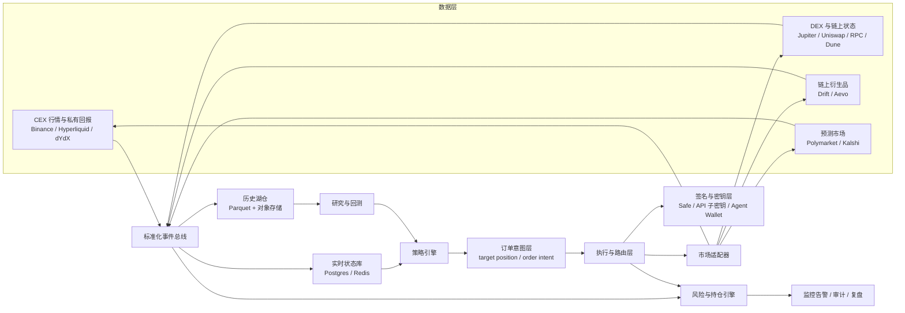
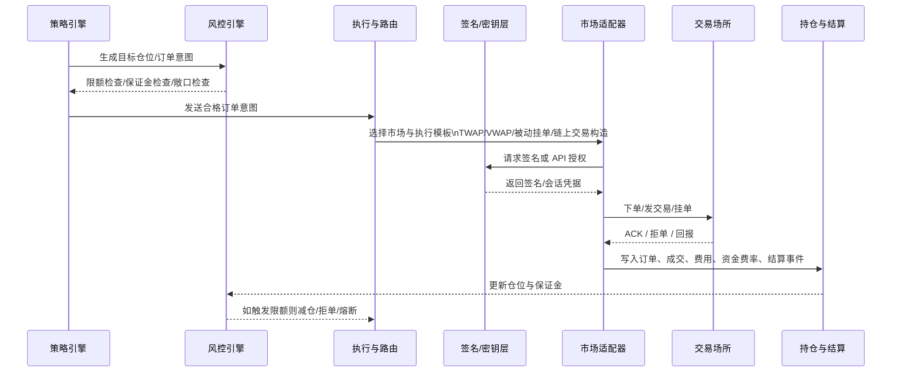

# 面向个人的加密量化系统搭建报告

## 执行摘要

如果目标不是“写一个能下单的脚本”，而是搭建一个**完整、可扩展、可审计、可回测、能跨市场复用**的量化系统，那么最重要的设计原则只有一句话：**把“研究”和“交易”彻底拆开，把“策略”和“执行”彻底拆开，把“权限”和“资金”彻底拆开**。过去五年的官方 API、SDK、开源机器人和预测市场基础设施已经非常成熟：CEX 侧可以通过 Binance 的 REST / WebSocket / FIX / SBE 接口做现货与永续；链上现货侧可以通过 Jupiter、Uniswap 与 Hummingbot Gateway 做路由、报价和原子交易；链上永续/期权侧可以通过 Hyperliquid、dYdX、Drift、Aevo 等官方 SDK 与索引层接入；预测市场侧则可以通过 Polymarket 和 Kalshi 的 REST / WebSocket / SDK 进行市场数据订阅和订单执行。也就是说，**今天的瓶颈已经不主要是“有没有 API”，而是系统如何把不同市场的状态、风险和执行语义统一起来。** 

对个人从业者而言，最现实的路线不是一开始追求“全市场、全策略、超低延迟”，而是先做一个**统一研究底座 + 多市场适配层 + 单账户风险总控**。研究底座负责采集、清洗、标准化行情、链上状态、事件元数据与成交回报；适配层负责把统一的 `order intent` 翻译成 Binance / Hyperliquid / Jupiter / Uniswap / Polymarket / Kalshi 这类不同接口的真实请求；风险层负责杠杆、仓位、保证金、清算距离、事件敞口、资金费率、授权额度与地理合规。这样的分层做法，既能支持 CEX 做市和永续套利，也能支持 DEX 路由和 AMM 策略，还能接上预测市场做市或事件驱动策略。Hummingbot、CCXT、Freqtrade、VectorBT、Backtrader、Dune API 与各大官方 SDK 的共同意义，正是把这些层拆得足够清晰。 

系统设计上，**不同市场最本质的差异不在“能不能下单”，而在“状态机和成交模型是否一致”**。CEX 现货/永续和部分链上订单簿型场所，本质是实时 order book + 私有回报流；DEX AMM 更像“基于链上状态与 gas 的交易构造问题”；链上永续/期权通常是“交易层低延迟、结算层上链、风控层受保证金与 oracle 约束”；预测市场则是“订单簿 + 事件解析 + 到期/结算语义”的混合系统。因此，一个完整的量化框架不能只做价格序列回测；它必须额外模拟**费用、滑点、部分成交、资金费率、LP 费收入、LVR/IL、链上确认失败、gas、事件结算、API 限流、签名与权限模型**。否则，研究层得到的“alpha”很容易在执行层全部蒸发。 

本报告的结论很明确：对于具备中级区块链与量化交易知识的个人，**最优先的不是去造一个“大而全”的机器人，而是先搭一个“研究可信、执行稳定、风险可控、密钥安全”的小而完整系统**。建议按三个阶段推进。第一阶段，用 VectorBT / Freqtrade / Dune API / 历史行情搭研究与回测实验室；第二阶段，用 Binance Testnet、Kalshi Demo、Hummingbot Docker、官方 SDK 做纸交易和小规模实盘；第三阶段，再把链上 DEX、链上永续/期权和预测市场接到统一投资组合与风险引擎之上。这样做的结果是：你得到的不是一个“单一 bot”，而是一套可持续迭代的量化操作系统。 

## 方法与数据来源

本报告按用户要求，以 **2021-05-23 至 2026-05-23** 作为主检索窗口，优先使用**官方 API/SDK 文档、项目官方开发文档、项目/协议仓库、白皮书/研究论文、审计与安全说明**，再用 GitHub、Reddit 和中文教程做补充验证。由于你要求的是“可搭建、可操作”的系统报告，因此证据权重优先给到**接口能力、身份验证方式、订单/行情接口、测试环境、示例机器人、结算语义、费率/资金费率与路由方式**这些直接影响系统落地的内容；而不是只看社区复盘或策略收益截图。 

需要特别说明三点。第一，本文中的**延迟目标、成本区间、硬件建议**，大多是结合官方接口形态与开源框架经验做出的工程估算，不是平台 SLA，也不是云厂商固定报价。第二，本文讨论的是**合法合规的量化系统搭建**，因此不会提供规避监管、绕过地理限制、恶意 MEV、盗签名、滥用 API 或其他攻击性脚本。第三，某些平台在 2025-2026 年发生过重要接口升级，例如 Polymarket 已在 2026 年 4 月切换到 **CLOB V2**，旧的 Python CLOB client 仓库在 2026 年 5 月归档；Jupiter 文档也明确提示旧的 Metis Swap API 已不再主动维护，应该优先跟进当前 Swap 平台文档。对于多市场系统来说，**接口升级治理**本身就是架构问题的一部分。 

## 系统架构详述

完整量化系统建议按六层来搭：**数据层、研究层、策略层、执行层、风控与持仓层、监控审计层**。数据层负责把来自 Binance、Hyperliquid、dYdX、Drift、Aevo、Polymarket、Kalshi、Jupiter、Uniswap、Dune 等来源的行情、订单簿、成交、持仓、资金费率、链上状态、事件元数据、费用和结算事件统一成标准事件流；研究层负责特征工程、策略开发、回测和参数搜索；策略层只产生“目标仓位/目标订单意图”；执行层负责路由、订单分片、撤改单和链上交易构造；风控层负责仓位、杠杆、保证金、保证金占用、净敞口、清算距离和异常熔断；监控审计层负责指标、报警、交易日志、签名日志、税务和复盘。官方文档已经提供了这一拆分所需的接口基础：Binance 有 REST / WebSocket / FIX；Hyperliquid、dYdX、Aevo、Polymarket、Kalshi 都有可编排的市场数据和交易 API；Jupiter 和 Uniswap 提供了报价、路由和交易构造能力；Dune 提供了可程序化调用的数据 API。 

不同市场的数据与延迟需求应该按**市场微观结构**来定，而不是“一刀切”。下表综合了 Binance、Hyperliquid、Jupiter、Uniswap、dYdX、Drift、Aevo、Polymarket 和 Kalshi 的接口与产品形态；其中“建议延迟目标”是工程建议，不是这些平台的公开 SLA。 

| 市场类型 | 典型平台 | 核心数据源 | 私有状态源 | 工程上的建议延迟目标 | 更适合的策略 |
|---|---|---|---|---|---|
| CEX 现货 / 永续 | Binance、部分 Hummingbot 连接器市场 | L2/L3 订单簿、成交、标记价格、资金费率 WebSocket | 私有订单/成交/持仓流 | 做市/套利建议百毫秒级；中低频可放宽到 0.5–2 秒 | 做市、资金费率套利、短中周期 CTA |
| DEX 现货 / AMM / 限价 | Jupiter、Uniswap、DEX 聚合器 | Quote/route、池状态、RPC、链上事件 | 钱包 nonce、交易确认、授权状态 | 秒级稳定性通常比极限低延迟更重要 | 路由优化、AMM 套利、LP 再平衡 |
| 链上永续 / 期权 | Hyperliquid、dYdX、Drift、Aevo | 订单簿 / indexer / funding / oracle / position streams | 保证金、仓位、清算风险、签名状态 | 订单簿型链上衍生品建议控制在 50–300ms 量级 | 做市、basis/funding、跨所对冲 |
| 预测市场 | Polymarket、Kalshi | orderbook / market metadata / event stream / 外部事件数据 | 持仓、订单、结算状态 | 方向交易可秒到分钟级；做市建议亚秒到秒级 | 做市、事件驱动、跨市场配对 |

在数据模型上，建议不要按“平台接口”建表，而要按**交易事件语义**建表。最少要有九类主实体：`market`、`instrument`、`orderbook_snapshot`、`trade`、`order`、`fill`、`position`、`cashflow`、`resolution_event`。其中 `cashflow` 要统一收口手续费、资金费率、借贷利息、LP 费收入、maker rebate、taker rebate、链上 gas 和桥接费用；`resolution_event` 则是预测市场和到期合约不可缺的结算实体。Polymarket 的 maker rebates / liquidity rewards、Hyperliquid 与 dYdX 的 hourly funding、Uniswap v3/v4 的 fee accrual、Kalshi 的事件合约交易数据，都说明如果你的持仓引擎不单独建 `cashflow` 和 `resolution` 两层，最后的收益归因会失真。 

## 策略与回测

研究与回测层的重点，不是“找到一条历史收益曲线”，而是让策略在**不同市场微观结构**下都能被正确评价。对 CEX 现货/永续，OHLCV 回测通常还能作为早期筛选；但一旦进入永续、做市、资金费率套利、跨所对冲、链上 AMM、预测市场做市等场景，你就必须采用**事件驱动或混合仿真**。这是因为永续合约收益的一大部分来自 funding/basis，而不是只有价格方向；AMM LP 的收益则不等于“手续费年化”，还依赖价格是否在区间内、是否持续被更快的套利者挑走库存，学术上常用 **Loss-Versus-Rebalancing** 来解释这种 adverse selection 代价。 

研究工具上，最实用的组合通常是“两层制”。第一层用 **VectorBT** 这类向量化引擎做大规模假设搜索，适合指标、参数、组合与因子扫描；第二层用 **Backtrader / Freqtrade / 自建事件驱动模拟器** 做更接近真实交易的回测和仿真。Freqtrade 官方文档把 backtesting、hyperopt、money management 和 web UI 都放进同一框架里，适合作为个人量化的“研究到部署”中枢；VectorBT 更适合做参数面、组合面和大规模实验；Backtrader 则更适合高可解释、事件驱动的研究原型。对链上数据和链上 alpha 挖掘，Dune API 与 `dune-client` 能把链上查询直接转成程序化数据源；SixdegreeLab/WTFAcademy 的中文教程则补上了链上分析的中文学习路径。 

过拟合防范不应只靠“留一段测试集”，而应至少包含四件事：**滚动 walk-forward、参数稳定性检验、交易成本嵌入、策略族而不是单一策略的对比**。针对加密资产，近年的研究已经明确指出，强化学习和复杂模型在 backtest 上尤其容易过拟合；更稳妥的方式，是在训练期之外重复估计 overfitting 风险，并把参数和模型复杂度一起纳入选择标准。换句话说，回测层应该输出的不只是收益率，还应输出**参数敏感度、训练—验证偏移、滑点弹性、费率敏感度、风格漂移**。这类要求并不是“学院派洁癖”，而是防止实盘中出现“一上线就失效”的最便宜方法。 

对不同市场，回测最容易漏掉的细节各不相同。CEX 永续最容易漏掉 funding、maker/taker 费率、部分成交与 order rate limits；DEX 最容易漏掉 gas、失败交易、slippage bound 和链上确认延迟；链上永续/期权最容易漏掉 oracle / indexer 延迟、清算触发与保证金波动；预测市场最容易漏掉订单簿深度、市场暂停、到期解析、结算时点和市场关闭逻辑。Kalshi 提供 demo environment，Binance 提供 testnet，Polymarket 和旧版/新版 CLOB client、Hummingbot 的 Docker 与回测环境，则给个人开发者提供了非常实际的 paper-trading / sandbox 路线。 

## 执行与路由

执行引擎应该只做一件事：**把策略层发来的“订单意图”安全、稳定、低偏差地变成真实成交**。对多市场系统，推荐统一定义一个 `order_intent`：包含目标市场、目标方向、目标名义、最大滑点、最小成交量、时间约束、风险标签、是否允许部分成交、是否允许原子多步执行、优先级与回滚规则。然后为不同市场分别实现适配器。这样做的好处是，策略不用知道 Binance 是 WebSocket API 还是 FIX、Jupiter 是 `quote + swap` 还是 `execute`、Uniswap 是 Universal Router 还是直接调 PoolManager、Polymarket 是 L1 钱包签名再派生 L2 API key，执行细节都隐藏在 adapter 层。 

对 **CEX 与链上订单簿型市场**，执行层的核心是三件事：**路由优先级、Child Order 分片、撤改单节流**。Binance 的 Spot/Futures WebSocket API 已支持通过 WebSocket 下单和撤单，且私有流与市场流分离；Hyperliquid、dYdX、Aevo、Polymarket、Kalshi 也都提供 market data stream 与交易接口。这意味着中级从业者完全可以把订单簿类市场统一抽象成 `quote / order / cancel / amend / fill / position update` 事件，而把 TWAP/VWAP、child slicing、maker-first、post-only、retry with backoff、cancel-on-disconnect 放在公共执行内核中。只要策略不是微秒级 HFT，这种抽象足够稳健。 

对 **DEX 现货/AMM**，执行引擎更像一个交易构造器，而不是订单发送器。Jupiter 的当前文档把 Meta-Aggregator 与 Router 清楚区分：前者可以给你完整交易并管理 landing，后者则给原始 swap instructions，让你完全控制交易内容、priority fees 与 composability；Uniswap 则建议程序化执行时优先使用 Universal Router，并通过 Permit2 管理授权、通过 smart order router 计算最优路径。对个人系统而言，这意味着 DEX adapter 必须至少支持三种模式：**只要最优报价、要原始指令自己组包、要完整交易直接发送**。如果你的 DEX 模块仍然只是“拿到一个 quote 然后立刻发送”，那它很难支持跨池路由、swap-and-add、链上再平衡或复杂组合交易。 

对 **链上原子策略与闪电回合**，建议只把它们放进专门的、可审计的策略管线，而不要混进普通执行链路。Aave v3 官方把 flashLoan / flashLoanSimple 的语义写得很清楚：借入的流动性必须在同一笔交易内归还，或在允许时留下债务头寸；其 swap adapter 还把“用抵押还债”“借款头寸切换”等多步操作封装成单笔原子交易。这类能力非常适合**清算、债务切换、原子套利、无余额再平衡**，但不适合做普通交易引擎的默认路径，因为失败语义、gas、链上风险和合约审计要求都更高。 

对 **预测市场执行**，关键不是“谁先下单”，而是“你的报价是否同时考虑盘口深度、事件信息价值和结算语义”。Polymarket 的所有订单都以 limit order 形式表达，实时报价和成交则通过 market WebSocket channel 推送；其 maker rebates 和 liquidity rewards 机制意味着做市系统不仅要看 spread，还要看奖励函数。Kalshi 同样提供 orderbook / trade execution / WebSocket，并且有 demo environment 方便测试。因此，预测市场 adapter 至少要管理四类额外状态：**市场是否已关闭、事件是否即将解析、可对冲替代品是否存在、平台奖励是否改变了做市净收益**。 

## 风控、安全与合规

在多市场量化里，风控必须是**实时系统**，不能只是回测后的几条说明。最少要有四组实时规则。第一组是**预交易规则**：单市场最大名义敞口、单资产净暴露、最大杠杆、最大单笔下单量、最大滑点、最大未成交订单数、最小订单有效期。第二组是**持仓规则**：CEX 账户与链上账户分开记账、资金费率与借贷费单独记账、预测市场按事件族做聚合风险、链上 LP 与方向仓分开计量。第三组是**保证金与清算规则**：永续和期权策略要实时监控保证金率、清算价格、资金费率变化和 oracle 异常。Hyperliquid 与 dYdX 都按小时收取 funding；Drift 则明确提供 perpetual futures、spot leverage 以及自动化 bot 文档；这些产品都不是只看价格方向即可。第四组是**执行异常规则**：撤单失败、链上交易未确认、nonce 冲突、连接掉线、订单状态不一致、部分成交超阈值后自动转为 reduce-only 或强制冲销。 

在安全上，个人量化系统最常见的真实问题不是“策略错了”，而是**密钥与权限模型做错了**。官方文档已经给出了相当明确的最佳实践方向：Binance 目前支持 HMAC、RSA 和 Ed25519，并明确推荐 Ed25519；Hyperliquid 的 API wallet 可以代表账户执行操作，但没有提现权限；Polymarket 的交易认证分成 L1 钱包签名与 L2 HMAC 两层；Safe 则提供多签、Modules 和 Guards，允许你在签名阈值之外再加交易检查。把这些组合起来，一个更稳妥的做法是：**资金库用 Safe，多签控出金；交易主机只持有无提现权限的 API 子密钥或 agent wallet；高风险策略单独使用隔离子账户；所有签名动作都记录哈希与上下文；提现和密钥轮换永远不在策略主机上执行。** 

合规方面，多市场系统最容易忽视的是：**同样是“下单”，不同平台的法域要求完全不同**。Kalshi 在文档与官网上明确把自己定位为 CFTC 监管下的 DCM，并提供 demo 环境和开发者协议；Polymarket 官方则明确要求应用在下单前做 geoblock 检查，官方 agents 仓库也写明限制美国人和部分受限地区用户交易。对于个人量化系统，这意味着“系统设计”本身就要包含**市场白名单、地理合规白名单、是否需要 KYC 的配置、账户来源证明、税务留档和 API key 生命周期管理**。如果这些约束没有在系统层面固化，而只是“手工知道”，那么一旦人员、钱包或账户数量变多，很快会失控。 

对链上衍生品和 DEX，还应把**oracle 与链上状态安全**纳入风控，而不是交给策略自己处理。Chainlink 的数据源选择文档明确建议使用 stale checks、deviation checks 和 circuit breakers；Aave、Uniswap 与 Drift 等体系也都说明，多步链上交易和保证金逻辑需要把价格源、状态确认和停机机制一起考虑。对个人团队来说，最简单也最常被忽视的规则其实是：**任何依赖外部价格、外部索引器或桥接状态的策略，都要有“数据异常即停止开新仓”的 kill switch。** 

## 部署运维、MVP与实施步骤

部署上，建议把系统拆成三种主机角色，而不是“一台服务器全做完”。第一类是**研究主机**，负责特征工程、回测、参数搜索、报表与数据下载；第二类是**执行主机**，只跑适配器、风控和交易进程，尽量靠近主要交易所或低时延 RPC；第三类是**安全主机/签名主机**，负责多签、密钥管理、轮换脚本和应急操作。Hummingbot 官方把 Docker 作为最简单的安装方式；其 Gateway 还可以作为 DEX 中间件统一链和协议交互。Drift 的仓库提供 devcontainer；GitHub Actions 官方则明确支持 self-hosted runners，适合在你自己的私有环境里做 CI/CD 和回归测试。对个人系统来说，这套分工已经足以把“开发、部署、签名、交易”四件事隔离开。 

成本与硬件上，更合理的做法是按阶段投资，而不是一开始就堆配置。下面的区间是工程估算，用于帮助做预算，不是官方报价。  

| 场景 | 典型用途 | 建议硬件/网络 | 估算月成本 |
|---|---|---|---|
| 研究型 MVP | 单人研究、历史回测、Dune 查询、少量 paper trading | 本地 8–16 核 CPU、32–64GB 内存、1–2TB NVMe；普通千兆网络即可 | 0–300 美元 |
| 单市场实盘 | 1–2 个 CEX 或 1 个链上衍生品 + 1 个 DEX | 1 台研究机 + 1 台 2–4 核 / 8–16GB VPS；稳定低抖动网络；可靠 NTP | 80–500 美元 |
| 多市场组合 | CEX + DEX + 链上衍生品 + 预测市场 | 2–3 台隔离节点、专用日志/监控、优质 RPC/数据服务、备份线路 | 500–3000+ 美元 |

如果只做 **MVP**，最小可行系统不应该试图同时覆盖所有市场。更合理的 MVP 组合是：**一个研究栈 + 一个订单簿型市场 + 一个 DEX 路由场景 + 一个预测市场沙盒**。具体清单可以这样定：
1. 数据：接 Binance 或 Hyperliquid 的实时行情，接 Dune API 拉链上历史，接 Polymarket 或 Kalshi 的市场元数据。  
2. 研究：用 VectorBT 做参数扫描，再用 Freqtrade 或自建事件驱动器做带费用的仿真。  
3. 执行：先接一个 CEX / 订单簿型 venue，再接一个 Jupiter 或 Uniswap adapter。  
4. 风控：实现最大仓位、最大杠杆、最大滑点、最大事件敞口、熔断阈值。  
5. 安全：至少做到 API 子密钥与提现密钥分离；链上资金采用 Safe 或冷钱包管理。  
6. 监控：最少输出订单延迟、拒单率、成交滑点、PnL、资金费率、异常签名和进程心跳。  
7. 审计：保留订单、成交、cashflow、结算和签名日志。 

更可落地的实施步骤，建议按下面的顺序推进，而不是并行开工：
1. **先确定市场优先级**：先选一个主战场，通常是 Binance/Hyperliquid 或 Polymarket/Kalshi 之一。  
2. **统一数据模型**：把所有行情、订单和 cashflow 映射到统一 schema。  
3. **先做研究栈**：历史数据、特征工程、回测、参数网格、walk-forward。  
4. **再做 paper trading / testnet**：Binance testnet、Kalshi demo、官方 SDK sandbox。  
5. **再接真实执行**：只开一个小资金账户，先验证端到端状态一致性。  
6. **最后才扩市场**：把 DEX、链上永续/期权、预测市场逐一加进来。  
7. **每加一个市场，都先补风控与审计**，再允许策略接入。  
这条顺序之所以重要，是因为从 Binance WebSocket 到 Jupiter raw instructions、再到 Polymarket CLOB V2 和 Kalshi demo，你面对的根本不是“多几个 endpoint”，而是**多了几套不同的交易语义和失败语义**。 

## 案例、工具矩阵与结论

先看工具矩阵。下表综合自 CCXT、Hummingbot、Freqtrade、VectorBT、Backtrader、Dune、Jupiter、Uniswap、Hyperliquid、dYdX、Drift、Aevo、Polymarket 与 Kalshi 的官方文档或仓库描述；其中“适用环节”是本报告对这些工具在个人量化系统中的定位总结。 

| 工具/库 | 主要功能 | 语言 | 更适合的环节 | 链接属性 |
|---|---|---|---|---|
| CCXT | 统一 CEX API 抽象、市场/订单/账户操作 | JS/TS/Python/PHP/C#/Go | CEX 适配层 | 官方开源 |
| Hummingbot | 多市场自动化交易框架，支持做市、套利、Gateway | Python | 执行层、路由层、回测/部署 | 官方开源 |
| Hummingbot Gateway | 统一 DEX / 链交互中间层 | TypeScript/Node | DEX 适配层 | 官方开源 |
| Freqtrade | 研究、回测、实盘、Hyperopt、一体化 bot | Python | 研究到部署闭环 | 官方开源 |
| VectorBT | 大规模向量化参数搜索与组合研究 | Python | 研究层 | 开源 |
| Backtrader | 事件驱动回测与策略框架 | Python | 研究层 / 中频原型 | 开源 |
| Dune API / dune-client | 链上分析 API、结果查询与数据服务化 | Python/API | 数据层 / 特征层 | 官方 |
| Jupiter Swap API | Solana DEX 路由与交易构造 | REST/Rust 客户端 | DEX 执行层 | 官方 |
| Uniswap SDK / Universal Router | 路由、报价、授权与多版本 AMM 组合 | TS/合约 | EVM DEX 执行层 | 官方 |
| Hyperliquid Python SDK | 链上订单簿永续/现货交易 | Python | 链上永续执行层 | 官方 |
| dYdX v4-clients | dYdX Chain 交易与查询客户端 | TS/Python/Rust | 链上永续执行层 | 官方 |
| Drift protocol-v2 | Solana 链上永续、SDK 与 keeper bots | TS/Rust | 链上永续与自动化 | 官方开源 |
| Aevo SDK | 期权/永续，off-chain matching + on-chain settlement | Python | 链上衍生品执行层 | 官方开源 |
| Polymarket CLOB Clients / CLI / MM | 预测市场数据、交易、做市 | TS/Python/Rust | 预测市场研究/执行 | 官方开源 |
| Kalshi API / Python SDK | 预测市场市场数据、交易、Demo 环境 | REST/Python | 预测市场执行与仿真 | 官方 |

再看按市场类型整理的**真实开源或学术案例**。这里优先列官方仓库、官方 SDK、官方 release notes 和学术论文；若是社区工具，会明确标注“非官方”。时间以仓库/文档可见时间或搜索结果时间为准。 

| 市场类型 | 案例 | 作者/账号 | 时间 | 价值 |
|---|---|---|---|---|
| CEX 现货 / 永续 | Hummingbot `Funding Rate Arbitrage` 与 `XEMM` 发布 | Hummingbot | 2024-05-01 社区发布页 | 证明一个执行框架可同时支持 funding arb 与跨所做市 |
| CEX 现货 / 永续 | Freqtrade 主仓库与 backtesting / hyperopt 文档 | `freqtrade` | 仓库 2026-05-22 有更新；文档持续维护 | 证明个人系统可以把研究、回测、实盘放进同一 Python 栈 |
| CEX 现货 / 永续 | 《Fundamentals of Perpetual Futures》 | Shikun He 等 | 2024 版更新 | 为 funding / basis / friction-aware 建模提供理论基线 |
| DEX 现货 / AMM / 限价 | Jupiter Swap API / Router / raw instructions | `jup-ag` | 2026 文档 | 说明 Solana DEX 执行层应以“交易构造”而不是“直接下单”为中心 |
| DEX 现货 / AMM / 限价 | Uniswap Smart Order Router + Universal Router | Uniswap | 2026 文档 | 说明 EVM DEX 路由需要统一授权、路径与组合执行 |
| DEX 现货 / AMM / 限价 | Hummingbot Gateway | Hummingbot | 持续更新 | 说明 DEX 适配可通过中间件统一链/协议差异 |
| 链上永续 / 期权 | Drift `protocol-v2` + keeper bots | Drift Labs | 2026-02-27 文档 / 仓库持续更新 | 提供 makers、liquidators、fillers 的真实 bot 结构 |
| 链上永续 / 期权 | dYdX `v4-chain` + `v4-clients` | dYdX / Nethermind | 2026-02 至 2026-03 文档 | 展示链上永续“链 + indexer + client”三层架构 |
| 链上永续 / 期权 | Aevo SDK | `aevoxyz` | 2026-04-20 文档、仓库当前可用 | 展示 off-chain matching / on-chain settlement 的衍生品接入方式 |
| 预测市场 | Polymarket `poly-market-maker` | Polymarket | 持续维护 | 官方做市 keeper，可直接反映 CLOB 市场做市逻辑 |
| 预测市场 | Polymarket CLI / CLOB V2 / 新 SDK | Polymarket | 2026-04-28 CLOB V2；CLI 当前可用 | 说明预测市场交易栈可被标准化为 CLI / SDK / Agents |
| 预测市场 | Kalshi API + Demo Environment；PyKalshi 为非官方增强客户端 | Kalshi / `arshka` | 官方文档 2026；社区客户端 2026-02 前后活跃 | 给出 regulated PM 的正式环境与社区工程实践 |

最后给出一个适合个人落地的**最小可行蓝图**。如果只允许优先做最有复用价值的部分，我会建议这样搭：  
第一，数据统一优先于策略统一。先把 Binance / Hyperliquid / Jupiter / Polymarket / Kalshi 的事件统一，再谈 alpha。  
第二，执行稳定优先于信号复杂。先把 ACK、fill、cancel、reconnect、nonce、wallet auth 跑通，再谈更复杂的模型。  
第三，单市场盈利优先于多市场覆盖。先在一个 order-book 市场和一个 DEX 场景内证明系统可控，再扩到链上永续和预测市场。  
第四，密钥与权限隔离优先于速度。Safe、多签、agent wallet、API 子密钥的正确使用，比多省几十毫秒更关键。  
第五，回测必须嵌入真实成本。若回测没有 funding、gas、maker/taker fee、LP fee、rebate、结算时点和失败交易成本，那么它不是生产级研究。 

总体判断是：在 2026 年搭建个人级完整加密量化系统，**技术上已经完全可行，真正的门槛主要在工程纪律，而不在接口可得性**。官方文档、开源 SDK、示例机器人、demo/testnet 和链上数据 API 的成熟度，已经足以让一个中级从业者做出从研究到部署的全链路系统；但如果没有严格的市场分层、执行分层、权限隔离、风险总控和审计留痕，那么系统越“完整”，反而越容易在实盘中失控。真正值得追求的，不是“更多市场”，而是**更少耦合、更高可测性和更清楚的失败边界**。 

## 结论与优先引用链接

本报告最重要的结论可以压缩成三句话。**第一，统一数据模型是地基，统一策略接口只是表层。第二，研究层一定要成本感知，执行层一定要失败感知。第三，私钥、权限、保证金和地理合规必须前置到系统设计，而不是写在 README 里。** 对个人从业者来说，真正的“完整系统”不是一个更复杂的 bot，而是一套能在 CEX、DEX、链上衍生品与预测市场之间复用的数据、执行、风控与审计操作系统。 

优先引用链接如下，按“先官方、后论文、再开源仓库/教程”的顺序整理：

- Binance Spot/Futures API 文档：REST / WebSocket / FIX / 速率限制 / API key 类型。   
- Hyperliquid API / Funding / API Wallet：链上订单簿 API、按小时 funding、无提现权限 API wallet。   
- Jupiter Developer Docs：Swap 平台、路由/原始指令、报价与 landing 控制。   
- Uniswap Developers：Universal Router、Smart Order Router、fee accrual、swap-and-add。   
- dYdX 文档与 v4 客户端：dYdX Chain、indexer、官方多语言 client、hourly funding。   
- Drift 文档与仓库：SDK、keeper bots、Solana 链上永续自动化。   
- Aevo 文档与 SDK：单保证金、off-chain matching + on-chain settlement、Python SDK。   
- Polymarket 文档 / SDK / CLI / CLOB V2 / 做市仓库：预测市场数据、交易、做市与 2026 升级。   
- Kalshi API / Demo / Developer Agreement / Regulation：预测市场 API、模拟环境与监管信息。   
- Dune API / Python SDK 与中文教程：链上研究数据入口。   
- Hummingbot / Gateway / Release Notes：多市场执行框架、DEX 中间件、Funding/XEMM 示例。   
- Freqtrade / VectorBT / Backtrader：研究、回测、参数优化与部署。   
- 学术参考：永续合约微观结构、AMM LVR、加密交易回测过拟合问题。   
- 安全与权限：Safe 多签/Guards、Binance Ed25519、Polymarket 双层认证。 