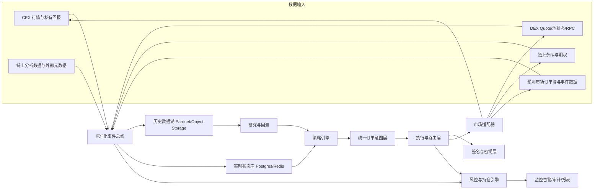
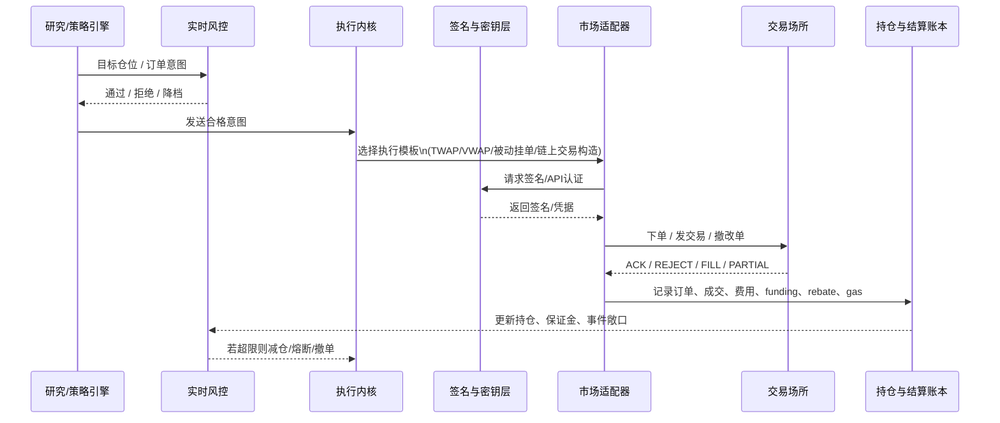

# 面向个人的加密量化系统工程落地指南

## 执行摘要

过去五年里，个人搭建“完整加密量化系统”的技术门槛已经明显下降，但系统复杂度并没有下降。原因在于：**接口更丰富了，市场却更异构了**。今天你可以同时接入 CEX 现货/永续、DEX 路由与 AMM、链上永续/期权，以及预测市场，但这些市场在订单语义、成交模型、结算逻辑、权限模型、风险来源和合规边界上都不同。Binance 已提供 REST、市场与交易 WebSocket、Spot/Futures Testnet，以及 FIX 接口；Jupiter、Uniswap、dYdX、Drift、Aevo、Polymarket、Kalshi、Dune 也都提供了面向交易机器人、分析工具或自动化策略的官方 API / SDK / 文档。这意味着，**个人已经不缺“能下单的接口”，真正缺的是一套把研究、执行、风控、持仓、审计和密钥管理统一起来的系统工程方法。** 

从工程角度看，最重要的结论是：**完整量化系统不应以“机器人”为中心，而应以“统一数据模型 + 统一订单意图 + 统一风险账本”为中心**。策略层只输出“目标仓位”或“订单意图”；执行层负责把它翻译为 Binance 的 API 请求、Jupiter 的 swap instructions、Uniswap 的 Universal Router 调用、Polymarket 的 EIP-712 限价单、Kalshi 的交易 API、或链上衍生品的签名交易；风险层负责统一处理杠杆、保证金、资金费率、LP 手续费、maker rebate、gas、事件结算和清算距离。只有这样，一个研究框架才可能同时服务于 CEX 套利、DEX 路由、链上永续对冲和预测市场做市。 

从可落地性看，个人团队最合理的路线不是一开始追求“全市场、超低延迟、高频化”，而是分三步推进。第一步，先搭**研究与回测底座**，包括历史数据、链上数据、费用模型和 walk-forward 验证；第二步，再搭**真实执行与风控底座**，先接一个 CEX 和一个 DEX 或一个预测市场沙盒，完成 paper trading、小资金真实验证和审计留痕；第三步，最后才扩展到链上永续/期权、预测市场做市、跨市场资金调度和多账户配置。Freqtrade、VectorBT、Backtrader、CCXT、Hummingbot、Dune API、Safe、Docker Compose、GitHub Actions self-hosted runners，以及 Prometheus/Grafana，已经构成了一套足够成熟的个人级技术栈。 

如果把这份报告压缩成一句工程建议，那就是：**先把“研究可信、执行稳定、风险一致、密钥安全”做对，再去追求更高 alpha、更低延迟和更多市场**。否则，系统会越来越“完整”，但也会越来越难以验证、难以调试、难以审计，最终在真实资金面前暴露结构性缺陷。学术研究对永续合约 funding、AMM 的 LVR，以及加密回测过拟合的讨论，恰好共同支持这一点：市场 edge 不能脱离交易摩擦、微观结构和风控边界来讨论。 

## 方法与数据来源

本报告以 **2021-05-23 至 2026-05-23** 为主时间窗，按“**官方文档与学术论文优先，开源仓库与中文教程辅助**”的方法组织证据。第一层证据包括 Binance、Jupiter、Uniswap、Hyperliquid、dYdX、Drift、Aevo、Polymarket、Kalshi、Dune、Aave、Safe、Chainlink 以及 Docker、GitHub、Grafana/Prometheus 的官方文档，用于确认接口能力、认证方式、测试环境、结算语义、风控与安全约束。第二层证据包括 Hummingbot、Freqtrade、CCXT、VectorBT、Backtrader、Drift keeper bots、Polymarket 官方仓库等开源项目，用于确认“实际如何组织代码与流程”。第三层证据为学术论文与中文实操教程，用于补充建模、过拟合防范和中文语境下的落地经验。本文中凡采用英文资料，均已直接用中文转述其关键技术要点。 

需要说明的是，本文中的**延迟目标、成本区间、硬件建议和典型起步资金**属于工程估算，不是平台 SLA，也不是法律、税务或财务建议。相反，诸如 WebSocket 断连规则、API 认证方式、是否提供 testnet/demo、订单是否本质上是 limit order、是否存在 geoblock、交易是否 offchain matching + onchain settlement、是否必须做 stale/deviation checks 之类的关键事实，均尽量以官方文档或学术论文为依据。对于缺乏统一官方口径的细节，文中会明确标注为经验判断或“未指定”。 

## 系统架构详述

一个完整的个人级加密量化系统，建议至少拆成六层：**数据层、研究与策略层、执行层、风控层、持仓与结算层、监控审计层**。数据层负责采集并标准化来自 CEX、DEX、链上衍生品和预测市场的价格、订单簿、成交、资金费率、链上状态、市场元数据与事件结果；研究层负责因子、信号、回测、参数搜索与实验管理；执行层负责交易路由、分片下单、撤改单、交易构造和签名；风控层负责仓位、杠杆、保证金、清算距离、最大滑点和市场/事件敞口；持仓与结算层负责统一记账交易费用、funding、借贷利息、LP 手续费、maker rebate、gas 与事件结算；监控审计层负责日志、告警、指标、税务留痕和事后归因。这个分层不是教条，而是为了应对不同市场在成交与结算语义上的根本差异。 

在市场覆盖上，建议从工程上把系统区分为四类对象，而不是只按“平台名”分模块。第一类是 **CEX 现货/永续**，典型如 Binance，这类市场适合 order-book 导向的中低频趋势、套利和做市；第二类是 **DEX 现货/AMM/限价**，典型如 Jupiter 与 Uniswap，这类市场更适合路由优化、原子再平衡、资金搬运、LP 管理或 quote-driven 执行；第三类是 **链上合约/期权**，典型如 dYdX、Drift、Aevo 以及支持 API wallet 的链上撮合型场所，这类市场需要更严格的保证金、清算、oracle 和签名管理；第四类是 **预测市场**，典型如 Polymarket 与 Kalshi，它们除了订单簿以外，还引入了事件解析、市场关闭、结果结算和更复杂的合规边界。 

| 维度 | CEX 现货/永续 | DEX 现货/AMM/限价 | 链上合约/期权 | 预测市场 |
|---|---|---|---|---|
| 代表平台 | Binance | Jupiter、Uniswap | dYdX、Drift、Aevo、Hyperliquid | Polymarket、Kalshi |
| 主要状态机 | 订单簿 + 私有成交回报 | 报价/路由 + RPC/链上确认 | 订单簿/索引器 + 保证金 + oracle | 订单簿 + 事件元数据 + 结果结算 |
| 建议数据延迟目标 | 做市/套利建议 50–300ms；中低频 0.5–2s | 100ms–数秒，重点是稳定性与 landing | 50–300ms，且要同步保证金/风控 | 做市 100ms–1s；方向交易可更宽松 |
| 系统复杂度 | 中 | 中到高 | 高 | 中到高 |
| 合规难度 | 中 | 中 | 中到高 | 高 |
| 经验起步资金 | 3,000–50,000 USDT | 1,000–20,000 USDT | 5,000–100,000 USDT | 1,000–20,000 USDT |
| 更适合的策略 | CTA、均值回归、funding/basis、做市 | 路由执行、AMM 套利、LP 再平衡 | 做市、对冲、期权与 basis、清算/keeper | 做市、事件驱动、跨市场价差 |

表中的平台能力与约束，主要依据各自官方 API / 产品文档：Binance 提供 Spot/Futures API、WebSocket、FIX 与 testnet；Jupiter 以 Quote / Swap / Swap Instructions 为核心；Uniswap 以 Universal Router 和 Smart Order Router 组织多池、多跳和 gas-aware 路由；dYdX、Drift、Aevo 提供衍生品交易与保证金模型；Polymarket 与 Kalshi 提供预测市场 API、demo/开发文档和市场执行语义。资金规模与延迟目标则属于工程经验估算。 

在数据设计上，不要按“交易所接口返回什么”来建模，而要按**交易生命周期**建模。最少建议有以下实体：`instrument`、`market`、`orderbook_snapshot`、`trade`、`order`、`fill`、`position`、`cashflow`、`resolution_event`。其中 `cashflow` 必须把 maker/taker fee、funding、借贷成本、LP fee、gas、rebate、liq fee 统一记账；`resolution_event` 则是预测市场、期权到期或事件合约结算不可缺少的数据层对象。否则，你在回测里看到的“收益曲线”和实盘里的“资金曲线”很容易完全不是一回事。Polymarket 的 maker rebate / liquidity rewards、dYdX 与永续文献对 funding 的强调，以及 Aevo 的 cross-margin 说明，都会直接影响这个账本层的设计。 

## 策略与回测

完整量化系统的研究流程，最好按“**信号发现 → 因子构造 → 成本感知回测 → 参数搜索 → 稳健性验证 → 纸交易 → 小资金实盘**”顺序推进，而不要反过来。工具上，一个被反复验证的个人级组合是：用 **VectorBT** 做大规模信号与参数扫描，用 **Freqtrade** 或 **Backtrader** 做更接近真实成交的回测与仿真，再用 **Dune API** 拉链上历史和事件性数据作为独立特征源。VectorBT 的强项是向量化和大规模参数实验；Freqtrade 的强项是把回测、Hyperopt、实盘和 Web UI 放进同一工作流；Backtrader 则适合可解释、事件驱动的策略原型。Dune 则适合作为链上因子与事件数据入口，而不是替代交易所低延迟行情。 

对加密市场而言，**回测必须是“市场微观结构感知”的**。CEX 永续不能只用 OHLCV，因为 funding 会持续改变真实收益；AMM/LP 不能只看手续费 APR，因为 LP 还要承担 LVR 和区间外风险；链上永续/期权不能只看成交价格，因为保证金、oracle、清算阈值和 indexer 延迟同样决定策略能否活下来；预测市场则不能只看价差，因为是否接近结算、市场能否关闭、订单是否仍是 resting order、以及市场解析规则都会改变策略边界。《Fundamentals of Perpetual Futures》说明 funding 是永续的核心机制，不是附带变量；《Automated Market Making and Loss-Versus-Rebalancing》则说明 LP 收益受 stale prices 和 arbitrageurs 影响，不能被简单理解为“赚手续费”；关于加密 DRL 的研究则明确提醒，复杂模型很容易在 backtest 上看起来很好，但实盘边际极不稳定。 

策略开发过程中，最应避免的不是“模型不够复杂”，而是**参数在样本内被调到过于脆弱**。实际工程上，至少建议做四件事：一是滚动的 walk-forward，而不是一次性划分训练/测试；二是做参数稳定性测试，关注相邻参数带是否都有效；三是把滑点、手续费、部分成交、撤单失败、gas、funding、rebate 与隔夜持仓成本都嵌入仿真；四是把策略和基准放在同一模拟框架里比较。对链上策略，再加两项：模拟失败交易和模拟确认延迟。对预测市场，再加一项：模拟结算时点和 market halt。Kalshi 的 demo environment、Binance 的 Spot/Futures testnet、以及官方 SDK 对 demo/test 环境的支持，使这套“研究—仿真—沙盒—小资金实盘”的流程可操作，而不是纸上谈兵。 

如果只给个人从业者一个实操性的研究建议，那就是：**先从“一个市场 + 一个风格 + 一个成本模型”开始，而不是从“全市场统一 alpha”开始**。例如，先做 Binance 或 Hyperliquid 上的 funding / basis 研究；或者先做 Jupiter / Uniswap 的 route-aware 执行研究；或者先做 Polymarket 的 maker rebate / liquidity rewards 驱动的报价研究。研究范围越窄，系统的真实噪音和实现偏差越容易被看清。Hummingbot 的 Funding Rate Arbitrage 示例、其后续统计套利控制器，以及 Polymarket 的官方做市仓库，本质上都在说明：**先把一条狭窄策略链路做对，再去抽象成通用框架。** 

## 执行与路由

执行引擎的核心目标不是“下单”，而是**把策略层的“订单意图”在不同市场里尽可能低偏差地变成真实成交**。建议设计一个统一的 `order_intent`，至少包括：目标市场、方向、目标名义、价格约束、最大滑点、允许部分成交、订单有效时间、是否允许 post-only、是否允许原子多步执行、风险标签和优先级。策略层永远不要直接调用某个交易所 SDK；它只应该产生意图。这样，执行层才能为 Binance 走 REST / WebSocket / FIX，为 Polymarket 走 EIP-712 限价单，为 Jupiter 走 quote + swap instructions，为 Uniswap 走 Universal Router，为 Kalshi 走 RSA API key，为 Hyperliquid 走 API wallet 与 nonce，为链上原子策略走单独的交易构造器。 

对 **CEX 和订单簿型市场**，执行引擎的关键能力是：**私有回报驱动状态机、Child Order 分片、撤改单节流、断线重连和时钟一致性**。Binance 文档明确说明，市场数据和 WebSocket API 是分离的；Spot 与 Futures 的 WebSocket 连接都有 24 小时会话上限，且 server 会定期 ping；Binance 还支持微秒级时间单位。这意味着，如果你的执行层没有独立的连接生命周期管理、时间同步、私有回报重放和断连恢复逻辑，那么即使策略信号本身正确，状态机也会逐渐失真。对 mid-frequency 策略来说，这类工程一致性通常比多优化 10ms 更重要。 

对 **DEX 路由与 AMM**，执行引擎更像“交易构造器”，而不是“下单器”。Jupiter 的当前文档把能力分成统一的 Swap API，并通过 Quote、Swap、Swap Instructions 来覆盖不同控制层级；Uniswap 的 Universal Router 可以把 v2、v3、v4 路径与 Permit2 授权统一编排，而 Smart Order Router 会在多路径之间权衡最优价格和 gas 成本。这意味着 DEX adapter 至少要支持三种模式：**只取报价、取原始指令自行组包、直接请求完整交易对象**。如果系统要做的是简单再平衡，拿完整交易即可；如果系统要做组合交易、链上再平衡、限价或更细的 tx landing 管理，就必须接入原始指令层。 

对 **链上永续与期权**，执行层需要把“交易指令”与“账户风险状态”黏在一起。dYdX 文档明确面向交易应用、bots 和 dashboards；Hyperliquid 提供公共 API、agent/API wallet 和 nonce 规则；Drift 则把 SDK、keeper bots、trigger bot、JIT maker 和 liquidator 文档化；Aevo 则把单保证金、off-chain matching、on-chain settlement 与 options/perps/OTC 放入同一产品体系。也就是说，这一类市场的 adapter 不能只关注 `place_order()`，还必须实时获取持仓、保证金、funding、oracle、风险参数和清算线。此外，Hyperliquid 对 signer nonce 的跟踪与时间窗要求，意味着你的签名与 nonce 存储必须具备持久化和重启恢复能力，不能依赖内存计数器。 

对 **预测市场**，执行逻辑必须兼顾订单簿和结算语义。Polymarket 官方文档明确说明其 CLOB 是“**offchain matching + onchain settlement**”的混合系统，所有订单本质上都是 limit order，所谓 market order 只是“以可成交价格提交的限价单”；其 maker rebates 和 liquidity rewards 机制又说明，做市机器人还需要内生考虑奖励函数，而不仅仅是 spread。Kalshi 则提供独立的 production/demo 环境、单独的 API key 生成流程，以及受监管的交易 API。对个人系统来说，这意味着预测市场 adapter 需要额外维护四类状态：**市场是否仍可交易、事件何时结算、订单是否靠近奖励区间、以及该市场是否受地理或监管限制。** 

如果系统需要支持**闪电贷/闪电回合**，最佳实践是把它放进“专用执行模板”，而不是混进普通订单路由。Aave v3 的 flash loans 允许在单笔交易内借入并归还流动性，或者在允许时转化为债务头寸；这非常适合原子套利、债务切换、无余额再平衡和特定的跨协议执行，但它也意味着更高的失败成本、交易构造复杂度和审计要求。因此，个人系统可以把它作为“高级模块”，而不应作为常规执行功能默认启用。 

## 风控、安全与合规

对多市场系统，风控必须是**在线、统一、可追责**的，而不能只是回测后的几条经验规则。最小可用的风控集应至少包含：单标的最大名义敞口、单市场与跨市场净暴露、最大滑点、最大订单生存时间、最大未成交订单数、最大杠杆、最小保证金缓冲、最大事件相关敞口、断线或数据异常时是否允许开新仓，以及失败交易后的降级策略。尤其是永续和期权账户，不能因为策略“理论上对冲了”就放松保证金监控；dYdX 的 funding、Aevo 的 cross-margin 和 maintenance margin、Drift 的 liquidator/trigger bots 全都说明，**策略收益和账户生存是两回事**。 

在安全上，个人常见错误不是“没有硬件钱包”，而是**交易权限、提现权限、部署权限和签名权限没有分层**。Binance 官方推荐 Ed25519 API keys，并支持 HMAC/RSA/Ed25519；Hyperliquid 的 API wallets 可以代表账户执行操作，但没有提现权限；Polymarket 的交易需要 EIP-712 签名与 API 凭证；Kalshi 则通过 RSA 私钥生成 API keys；Safe 又提供多签、Guards 和 Modules，可在多签之外增加交易前后检查和自动化逻辑。这一组事实共同指向一个最稳妥的设计：**资金库用 Safe 或冷钱包；交易执行主机只持有无提现权限的子密钥、agent wallet 或受限 API key；提现、密钥轮换和高风险权限变更不在策略主机上执行。** 

链上策略还必须把**授权与价格喂价风险**一并视为一级风险，而不是智能合约团队自己的事情。Uniswap 的路由和 v4 可组合性提高了策略空间，但也带来了更高的合约复杂度；OpenZeppelin 对 Uniswap v4 core 的审计说明，复杂路由/钩子体系确实需要专业审计；Chainlink 则明确建议对价格源做 stale checks、deviation checks 和 circuit breakers。这意味着任何会用到链上 oracle、v4 hook、自定义路由器或多步组合交易的系统，都应该把“异常价格/陈旧价格即停止开新仓”和“重要合约变更前必须复审”写成硬规则。 

合规层面，个人量化系统最容易低估的是**地理、账户和产品边界**。Kalshi 官方说明其作为 CFTC 监管下的 DCM 运行，并提供 demo environment；Polymarket 则明确要求下单前应做 geographic restrictions 检查，受限地区订单会被拒绝。对系统设计而言，这意味着合规不是“使用前看一遍条款”就结束，而是要写进配置和执行层：哪些市场允许接入、哪些账户是已完成 KYC 的、哪些策略允许在哪些司法区执行、哪些 API key 只允许观测不允许交易、哪些市场需要在下单前先过 geoblock/or identity check。对于涉及法币、受监管事件市场或集中化平台的系统，还应默认保留订单日志、成交日志、资金流与税务记录。 

## 部署运维、成本估算与实施步骤

从部署角度看，个人系统最不应该做的一件事，就是把**研究、执行、监控、签名和 CI/CD 全塞进同一台主机**。更合理的方式是至少拆成三类角色：研究主机、执行主机、签名/控制主机。研究主机负责历史数据、回测、报表和参数搜索；执行主机只运行市场适配器、风控与订单状态机；签名主机或控制主机则负责多签、密钥轮换、紧急停止和少量人工干预。Docker Compose 非常适合把研究服务、数据库、缓存、执行服务和监控组件编排起来；GitHub Actions 的 self-hosted runners 则适合把测试、镜像构建和部署放到你可控的机器上；Prometheus 与 Grafana 则构成最常用、上手成本最低的监控栈。 

下面的成本和硬件需求属于**工程经验估算**，不是官方价格。其意义不在于精确报价，而在于帮助你选择合适的起点，而不是一开始就为“未来可能需要的高频”过度投入。

| 场景 | 典型目标 | 建议配置 | 月度成本区间 |
|---|---|---|---|
| 研究型 MVP | 历史回测、Dune 查询、单账户 paper trading | 本地 8–16 核 CPU、32–64GB 内存、1–2TB NVMe；普通千兆网络 | 0–300 美元 |
| 单市场实盘 | 一个 CEX 或一个链上衍生品 + 一条风险链路 | 1 台研究机 + 1 台 2–4 核 / 8–16GB VPS；稳定时钟与日志 | 80–500 美元 |
| 多市场组合 | CEX + DEX + 预测市场 + 链上衍生品 | 2–3 台隔离节点、优质 RPC/数据订阅、独立监控告警 | 500–3000+ 美元 |

这些配置建议与市场特性的关系如下：CEX/订单簿策略更依赖连接稳定、时间同步和私有回报处理；DEX/链上策略更依赖稳定 RPC、交易构造、签名与故障恢复；预测市场的资源压力通常低于订单簿高频，但更依赖市场元数据、事件流与合规检查。官方文档中关于 Binance WebSocket 生命周期、Kalshi demo、Polymarket V2 迁移、Dune SDK、Hummingbot Gateway 与 Docker/GitHub/Grafana 的说明，都支持这种“分主机、分职责、轻量起步”的部署思路。 

如果只做一个**最小可行产品**，建议你的 MVP 清单只覆盖下列能力，而不要贪多：

| 模块 | MVP 必须项 | 推荐首选实现 |
|---|---|---|
| 数据层 | 一个低延迟市场流 + 一个研究数据源 | Binance/Hyperliquid 行情 + Dune API |
| 研究层 | 历史回测、参数扫描、交易成本模型 | VectorBT + Freqtrade/Backtrader |
| 执行层 | 一个订单簿 adapter + 一个 DEX adapter | Binance/Hyperliquid + Jupiter/Uniswap |
| 风控层 | 最大仓位、最大杠杆、最大滑点、熔断 | 自建规则引擎 |
| 安全层 | 交易密钥与提现密钥分离 | API 子密钥 / agent wallet + Safe |
| 监控层 | 订单延迟、拒单率、PnL、资金费率、心跳 | Prometheus + Grafana |
| 审计层 | 订单、成交、cashflow、签名日志 | Postgres + 对象存储归档 |

MVP 的推荐实现之所以这样搭配，是因为这些工具和接口都已经有足够成熟的官方资料：Dune 可以作为链上研究底座；VectorBT、Freqtrade、Backtrader 能覆盖研究和仿真；Hummingbot Gateway、Jupiter、Uniswap、Binance、Kalshi、Polymarket 都能提供真实或半真实的执行环境；Safe、GitHub Actions、Docker Compose 和 Grafana/Prometheus 则补足安全与运维层。 

更可复制的实施顺序建议如下。第一，先选一个主战场，不要一开始同时做四类市场。第二，先统一数据模型，再接策略。第三，先做历史回测和仿真，再跑沙盒，再上真实小资金。第四，每增加一个市场，就先补适配器、风控和审计，而不是先补策略。第五，只有当订单状态、持仓状态、资金状态和审计日志在端到端上完全一致后，才允许扩大资金规模。对中文读者而言，OneKey 关于“普通人如何开始加密量化交易”的文章、以及 Decert 的 Dune API 中文教程，可以作为官方英文文档之外的入门补充，但权重仍应低于官方接口和仓库文档。 

## 开源案例、工具矩阵与结论

先看**开源工具矩阵**。这里优先列出真正能用于系统搭建的工具，而不是“量化概念文章”。

| 工具/库 | 功能定位 | 语言 | 适用层 | 主要依据 |
|---|---|---|---|---|
| CCXT | 统一 CEX API 抽象、行情与交易访问 | Python / JS / C# / Go 等 | 市场适配层 |  |
| Hummingbot | 自动化做市/套利/交易框架 | Python | 执行层 |  |
| Hummingbot Gateway | 标准化 DEX / 链交互中间层 | TypeScript | DEX 适配层 |  |
| Freqtrade | 回测、Hyperopt、实盘、Web UI | Python | 研究到实盘闭环 |  |
| VectorBT | 向量化回测、参数与组合扫描 | Python | 研究层 |  |
| Backtrader | 事件驱动回测与 live trading | Python | 研究层 / 原型层 |  |
| Dune API / dune-client | 链上数据查询与程序化分析 | Python / TS / Go | 数据层 |  |
| Jupiter Swap API | Solana 路由、报价与交易构造 | REST / SDK | DEX 执行层 |  |
| Uniswap Universal Router / SOR | EVM 路由、Permit2、gas-aware 路由 | TypeScript / 合约 | DEX 执行层 |  |
| dYdX v4-clients | 链上永续多语言客户端 | TS / Python / Rust / C++ | 链上衍生品层 |  |
| Drift SDK / keeper-bots | 订单、账户、触发、清算、JIT | TS / Rust | 链上衍生品层 |  |
| Aevo SDK | 期权/永续/OTC 交易与签名 | Python | 链上衍生品层 |  |
| Polymarket CLOB clients / CLI / MM | 预测市场做市、交易、终端工具 | TS / Python / Rust | 预测市场层 |  |
| Kalshi API | 受监管预测市场交易 API 与 demo | REST / Python 社区客户端 | 预测市场层 |  |
| Safe | 多签、Guards、Modules | 智能合约 / SDK | 安全与权限层 |  |

再看**每类市场的真实开源或论文案例**。表中优先放官方仓库、官方 SDK、官方文档或学术论文；“作者/账号”按仓库组织名、项目官方或论文作者写明。

| 市场类型 | 案例 | 作者/账号 | 时间 | 为什么值得看 |
|---|---|---|---|---|
| CEX 现货/永续 | Hummingbot Funding Rate Arbitrage | Hummingbot Foundation | 2024-05-01 发布说明 | 展示 funding 差异策略如何被工程化成可执行脚本  |
| CEX 现货/永续 | Freqtrade 主仓库与 backtesting/hyperopt | `freqtrade` | 仓库持续更新；文档至 2026 仍维护 | 展示研究、回测、优化与实盘闭环如何落地  |
| CEX 现货/永续 | 《Fundamentals of Perpetual Futures》 | Shikun He 等 | 2024 版本可见 | 给 funding / basis / friction-aware 建模提供理论基础  |
| DEX 现货/AMM/限价 | Jupiter Swap API / Swap Instructions | Jupiter | 2026 文档 | 展示 Solana DEX 量化更像“交易构造”而非简单下单  |
| DEX 现货/AMM/限价 | Uniswap smart-order-router | Uniswap | 仓库当前可用 | 展示多路径、分单、gas-aware 路由的开源实现  |
| DEX 现货/AMM/限价 | 《Automated Market Making and LVR》 | Jason Milionis 等 | 2022，持续被引用到 2025 | 解释 LP 策略为何不能只看手续费 APR  |
| 链上合约/期权 | Drift keeper bots / Trading Automation | Drift Labs | 2026-02 文档 | 展示 matching、trigger、liquidator、JIT maker 的真实 bot 结构  |
| 链上合约/期权 | dYdX v4-clients | dYdX / Nethermind grant | 2026 文档与仓库 | 展示链上永续“链 + indexer + clients”的标准化接入方式  |
| 链上合约/期权 | Aevo SDK | `aevoxyz` | 文档 2026-04-20；仓库持续可用 | 展示期权/永续/OTC 在单保证金账户下的集成方式  |
| 预测市场 | Polymarket `poly-market-maker` | Polymarket | 仓库当前可用 | 官方做市 keeper，最接近预测市场做市实战  |
| 预测市场 | Polymarket `agents` 与 `polymarket-cli` | Polymarket | 2026 活跃 | 展示预测市场 agent / CLI / data tooling 的官方工程方向  |
| 预测市场 | 《Unravelling the Probabilistic Forest》 | Oriol Saguillo 等 | 2025-08 | 研究 Polymarket 中的 market rebalancing 与 combinatorial arbitrage，估计实现利润规模  |

如果把上面的工具和案例转换成**个人的最优路线图**，一个现实的建议是这样的：先用 Dune + VectorBT/Freqtrade/Backtrader 搭研究底座；再用 Binance/Hyperliquid 或 Kalshi demo 跑订单簿类执行；然后用 Jupiter 或 Uniswap 加入一个 DEX adapter；再之后才考虑 dYdX/Drift/Aevo/Polymarket 这种对保证金、nonce、事件结算和签名要求更高的市场。Hummingbot 和 Gateway 非常适合做“从原型到多市场适配”的桥梁；Safe、Docker Compose、GitHub Actions self-hosted runners 与 Prometheus/Grafana 则能把你的系统从“能跑”提升到“能长期维护”。 

最终建议只有三条。第一，**先统一账本，再统一策略**；没有统一的费用、funding、rebate、gas 和结算账本，跨市场 PnL 只会越来越失真。第二，**先把失败语义跑通，再追求更高收益**；不同市场的拒单、断线、失败交易、结算停机、确认延迟和 nonce 规则，本身就是量化系统最现实的损耗来源。第三，**先把权限和风控做窄，再扩大市场覆盖和资金规模**；对个人而言，最大的 blow-up 往往不是策略突然失效，而是执行状态机、保证金联动、私钥权限或审计链路出了错。官方文档、开源机器人和学术文献共同表明：真正可持续的加密量化系统，不是最花哨的，而是最能把“研究—执行—风险—结算—审计”闭环做对的那一类。 

以下是本报告末尾的**优先引用链接清单**，按“官方文档 → 论文 → 开源仓库/教程”排序，用于后续继续深挖：

- Binance API 文档：REST、WebSocket、FIX、testnet、API key 类型与时间精度。   
- Jupiter 与 Uniswap 开发者文档：Swap API、Swap Instructions、Universal Router、Smart Order Router。   
- dYdX、Drift、Aevo、Hyperliquid 开发文档：链上永续/期权、SDK、funding、nonce、keeper bots。   
- Polymarket 与 Kalshi 文档：CLOB、限价单语义、maker rebates、liquidity rewards、demo、地理限制与监管。   
- Dune API、Safe、Chainlink：链上数据、权限治理、oracle 风控。   
- 研究论文：永续 funding、AMM LVR、加密回测过拟合。   
- 开源仓库：Hummingbot、Gateway、Freqtrade、CCXT、VectorBT、Backtrader、Drift keeper-bots、Polymarket 市场做市与 agents。   
- 中文辅助资料：Decert 的 Dune API 教程、OneKey 的中文量化入门文章。 